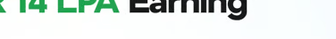
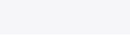
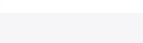
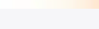
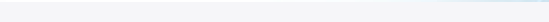

# guvi Design System

You are building UI for **guvi**. Light-themed, neutral palette, sans-serif typography (Jones), compact density on a 4px grid, expressive motion.

## Visual Reference

**IMPORTANT**: Study ALL screenshots below before writing any UI. Match colors, typography, spacing, layout, and motion exactly as shown.

### Homepage


### Scroll Journey (Cinematic Visual States)

> These screenshots capture the website at different scroll depths. The design changes dramatically as you scroll — each frame shows a different cinematic state. Replicate these exact visual transitions.

#### 0% — Hero / Above the fold


#### 17% — Mid-page at 17% scroll


#### 33% — Mid-page at 33% scroll


#### 50% — Mid-page at 50% scroll


#### 67% — Mid-page at 67% scroll


#### 83% — Mid-page at 83% scroll


#### 100% — Footer / End of page


> Read `references/DESIGN.md` for full token details. Read `references/ANIMATIONS.md` for motion specs. Read `references/LAYOUT.md` for layout structure. Read `references/COMPONENTS.md` for component patterns.

## Ultra Reference Files

This package includes extended documentation. **Read these files before implementing:**

| File | Contents |
|------|----------|
| `references/DESIGN.md` | Full design system tokens, colors, typography, spacing |
| `references/VISUAL_GUIDE.md` | **START HERE** — Master visual guide with all screenshots embedded |
| `references/ANIMATIONS.md` | CSS keyframes, scroll triggers, motion library stack, video specs |
| `references/LAYOUT.md` | Flex/grid containers, page structure, spacing relationships |
| `references/COMPONENTS.md` | DOM component patterns, HTML structure, class fingerprints |
| `references/INTERACTIONS.md` | Hover/focus states with before/after style diffs |
| `screens/scroll/` | 7 scroll journey screenshots showing cinematic states |

### Animation Stack Detected

- **Web Animations API (6 active)** — animation

## Design Philosophy

- **Layered depth** — use shadow tokens to create a sense of physical layering. Each elevation level has a specific shadow.
- **Gradient accents** — gradients are used thoughtfully for emphasis, not decoration.
- **Type pairing** — Jones for body/UI text, DM Sans for headings/display. Never introduce a third typeface.
- **compact density** — 4px base grid. Every dimension is a multiple of 4.
- **neutral palette** — the color temperature runs neutral, matching the sans-serif typography.
- **Expressive motion** — animations are an integral part of the experience. Use spring physics and layout animations.

## Color System

### Core Palette

| Role | Token | Hex | Use |
|------|-------|-----|-----|
| Background | `--background` | `#ffffff` | Page/app background |
| Text Primary | `--text-primary` | `#1f2937` | Headings, body text |
| Text Muted | `--text-muted` | `#334155` | Captions, placeholders |
| Border | `--border` | `#4d4d4d` | Dividers, card borders |

### Status Colors

| Status | Hex | Use |
|--------|-----|-----|
| Success | `#000d02` | Confirmations, positive trends |

### Extended Palette

- `#e5e7eb` — Light surface or highlight color
- `#f2f2f2` — Light surface or highlight color
- `#0c0b0e` — Deep background layer or shadow color
- `#b5b5b5`
- `#6c757d`
- `#5f6b78`
- **plyr-color-main:** `#0dba4b`
- `#18181b` — Deep background layer or shadow color

### CSS Variable Tokens

```css
--border-btn: 1px;
--tab-border: 1px;
--glass-border-opacity: 15%;
--glass-border-opacity: 15%;
--tab-border-color: var(--fallback-b3,oklch(var(--b3)/1));
--togglehandleborder: 0 0;
--glass-border-opacity: 15%;
--glass-border-opacity: 15%;
--plyr-video-background: transparent;
--ss-primary-color: #5897fb;
--ss-border-color: #dcdee2;
--ss-border-radius: 4px;
--border-btn: 1px;
--tab-border: 1px;
--glass-border-opacity: 15%;
--glass-border-opacity: 15%;
--tab-border-color: var(--fallback-b3,oklch(var(--b3)/1));
--togglehandleborder: 0 0;
--glass-border-opacity: 15%;
--glass-border-opacity: 15%;
```

## Typography

### Font Stack

- **Jones** — Heading 1, Heading 2, Heading 3
- **DM Sans** — Body, Caption
- **SFMono-Regular** — Code

### Font Sources

```css
@font-face {
  font-family: "DM Sans";
  src: url("fonts/DMSans-Bold.ttf") format("truetype");
  font-weight: 700;
}
@font-face {
  font-family: "DM Sans";
  src: url("fonts/DMSans-Regular.ttf") format("truetype");
  font-weight: 400;
}
@font-face {
  font-family: "Jones";
  src: url("fonts/Jones-Regular.woff2") format("woff2");
  font-weight: 400;
}
@font-face {
  font-family: "Jones";
  src: url("fonts/Jones-700.woff2") format("woff2");
  font-weight: 700;
}
@font-face {
  font-family: "Wanted Sans";
  src: url("fonts/WantedSans-Regular.woff2") format("woff2");
  font-weight: 400;
}
@font-face {
  font-family: "Wanted Sans";
  src: url("fonts/WantedSans-700.woff2") format("woff2");
  font-weight: 700;
}
@font-face {
  font-family: "Inter";
  src: url("fonts/Inter-Bold.ttf") format("truetype");
  font-weight: 700;
}
@font-face {
  font-family: "Inter";
  src: url("fonts/Inter-Regular.ttf") format("truetype");
  font-weight: 400;
}
```

### Type Scale

| Role | Family | Size | Weight |
|------|--------|------|--------|
| Heading 1 | Jones | 4rem | 700 |
| Heading 2 | Jones | 3.75rem | 700 |
| Heading 3 | Jones | 55px | 700 |
| Body | DM Sans | 1rem | 400 |
| Caption | DM Sans | .875rem | 400 |
| Code | SFMono-Regular | 14px | 400 |

### Typography Rules

- Body/UI: **Jones**, Headings: **DM Sans** — these are the only display fonts
- Max 3-4 font sizes per screen
- Headings: weight 600-700, body: weight 400
- Use color and opacity for text hierarchy, not additional font sizes
- Line height: 1.5 for body, 1.2 for headings

## Spacing & Layout

### Base Grid: 4px

Every dimension (margin, padding, gap, width, height) must be a multiple of **4px**.

### Spacing Scale

`2, 4, 6, 8, 10, 12, 14, 16, 18, 20, 22, 24` px

### Spacing as Meaning

| Spacing | Use |
|---------|-----|
| 4-8px | Tight: related items (icon + label, avatar + name) |
| 12-16px | Medium: between groups within a section |
| 24-32px | Wide: between distinct sections |
| 48px+ | Vast: major page section breaks |

### Border Radius

Scale: `.25rem, 1.9rem, inherit, unset, .125rem, .15rem, .375rem, .5rem, .75rem, 1rem, 1px, 1.5rem, 1.625rem, 2px, 2.5px, 3px, 3rem, 3px 3px 0px 0px, 4px, 5px, 6px, 7px, 8px, 9px, 10px, 12px, 14px, 15px, 16px, 16.92px, 17px, 18px, 20px, 24px, 25px, 26px, 30px, 32px, 40px, 50px, 100%, 100px, 999px`
Default: `7px`

### Container

Max-width: `1250px`, centered with auto margins.

### Breakpoints

| Name | Value |
|------|-------|
| md | 48rem |
| xs | 380px |
| xs | 400px |
| xs | 420px |
| xs | 425px |
| xs | 480px |
| sm | 500px |
| sm | 556px |
| sm | 557px |
| sm | 576px |
| sm | 577px |
| sm | 586px |
| sm | 600px |
| sm | 639px |
| sm | 640px |
| md | 650px |
| md | 652px |
| md | 680px |
| md | 767px |
| md | 768px |
| lg | 769px |
| lg | 820px |
| lg | 830px |
| lg | 959px |
| lg | 960px |
| lg | 992px |
| lg | 1000px |
| lg | 1023px |
| lg | 1024px |
| xl | 1025px |
| xl | 1200px |
| xl | 1215px |
| xl | 1220px |
| xl | 1250px |
| xl | 1279px |
| xl | 1280px |
| 2xl | 1360px |
| 2xl | 1366px |
| 2xl | 1376px |
| 2xl | 1377px |
| 2xl | 1400px |
| 2xl | 1440px |
| 2xl | 1800px |

Mobile-first: design for small screens, layer on responsive overrides.

## Component Patterns

### Card

```css
.card {
  background: #ffffff;
  border: 1px solid #4d4d4d;
  border-radius: 7px;
  padding: 16px;
  box-shadow: 0 0#0000,0 0#0000,0 0#0000;
}
```

```html
<div class="card">
  <h3>Card Title</h3>
  <p>Card content goes here.</p>
</div>
```

### Button

```css
/* Primary */
.btn-primary {
  background: #cccccc;
  color: #1f2937;
  border-radius: 7px;
  padding: 8px 16px;
  font-weight: 500;
  transition: opacity 150ms ease;
}
.btn-primary:hover { opacity: 0.9; }

/* Ghost */
.btn-ghost {
  background: transparent;
  border: 1px solid #4d4d4d;
  color: #1f2937;
  border-radius: 7px;
  padding: 8px 16px;
}
```

```html
<button class="btn-primary">Get Started</button>
<button class="btn-ghost">Learn More</button>
```

### Input

```css
.input {
  background: #ffffff;
  border: 1px solid #4d4d4d;
  border-radius: 7px;
  padding: 8px 12px;
  color: #1f2937;
  font-size: 14px;
}
.input:focus { border-color: var(--accent); outline: none; }
```

```html
<input class="input" type="text" placeholder="Search..." />
```

### Badge / Chip

```css
.badge {
  display: inline-flex;
  align-items: center;
  padding: 4px 8px;
  border-radius: 9999px;
  font-size: 12px;
  font-weight: 500;
  background: #ffffff;
  color: #334155;
}
```

```html
<span class="badge">New</span>
<span class="badge">Beta</span>
```

### Modal / Dialog

```css
.modal-backdrop { background: rgba(0, 0, 0, 0.6); }
.modal {
  background: #ffffff;
  border: 1px solid #4d4d4d;
  border-radius: 999px;
  padding: 24px;
  max-width: 480px;
  width: 90vw;
  box-shadow: 0 0 0 12px #fff inset,0 0 0 12px #fff inset;
}
```

```html
<div class="modal-backdrop">
  <div class="modal">
    <h2>Dialog Title</h2>
    <p>Dialog content.</p>
    <button class="btn-primary">Confirm</button>
    <button class="btn-ghost">Cancel</button>
  </div>
</div>
```

### Table

```css
.table { width: 100%; border-collapse: collapse; }
.table th {
  text-align: left;
  padding: 8px 12px;
  font-weight: 500;
  font-size: 12px;
  color: #334155;
  text-transform: uppercase;
  letter-spacing: 0.05em;
  border-bottom: 1px solid #4d4d4d;
}
.table td {
  padding: 12px;
  border-bottom: 1px solid #4d4d4d;
}
```

```html
<table class="table">
  <thead><tr><th>Name</th><th>Status</th><th>Date</th></tr></thead>
  <tbody>
    <tr><td>Item One</td><td>Active</td><td>Jan 1</td></tr>
    <tr><td>Item Two</td><td>Pending</td><td>Jan 2</td></tr>
  </tbody>
</table>
```

### Navigation

```css
.nav {
  display: flex;
  align-items: center;
  gap: 8px;
  padding: 12px 16px;
  border-bottom: 1px solid #4d4d4d;
}
.nav-link {
  color: #334155;
  padding: 8px 12px;
  border-radius: 7px;
  transition: color 150ms;
}
.nav-link:hover { color: #1f2937; }
```

```html
<nav class="nav">
  <a href="/" class="nav-link active">Home</a>
  <a href="/about" class="nav-link">About</a>
  <a href="/pricing" class="nav-link">Pricing</a>
  <button class="btn-primary" style="margin-left: auto">Get Started</button>
</nav>
```

### Extracted Components

These components were found in the codebase:

**Button** (`html`)
- Variants: `size`, `brochure`, `sm`, `ghost`, `primary`

**Input** (`html`)

**Card** (`html`)
- Variants: `container`, `contents`, `header`, `body`, `compact`

**Navigation** (`html`)

**Badge** (`html`)

**Modal** (`html`)

**List** (`html`)

## Page Structure

The following page sections were detected:

- **Hero** — Hero/banner section with headline and CTAs
- **Features** — Feature/benefit cards grid (84 items)
- **Faq** — FAQ/accordion section
- **Cta** — Call-to-action section
- **Stats** — Statistics/metrics display
- **Testimonials** — Testimonials/reviews section

When building pages, follow this section order and structure.

## Animation & Motion

This project uses **expressive motion**. Animations are part of the design language.

### CSS Animations

- `button-pop`
- `checkmark`
- `modal-pop`
- `progress-loading`
- `radiomark`

### Motion Tokens

- **Duration scale:** `0ms`, `.1s`, `.15s`, `.2s`, `.3s`, `.5s`, `.65s`, `.7s`, `15s`, `100ms`, `150ms`, `200ms`, `250ms`, `300ms`, `350ms`, `400ms`, `500ms`, `700ms`, `1000ms`, `30000ms`, `5000000ms`
- **Easing functions:** `ease`, `cubic-bezier(.4,0,.2,1)`, `cubic-bezier(0,0,.2,1)`, `ease-out`, `cubic-bezier(1,0,0,1)`, `ease-in-out`, `ease-in`, `linear`
- **Animated properties:** `height`

### Motion Guidelines

- **Duration:** Use values from the duration scale above. Short (0ms) for micro-interactions, long (5000000ms) for page transitions
- **Easing:** Use `ease` as the default easing curve
- **Direction:** Elements enter from bottom/right, exit to top/left
- **Reduced motion:** Always respect `prefers-reduced-motion` — disable animations when set

## Depth & Elevation

### Shadow Tokens

- Subtle: `0 0#0000,0 0#0000,0 1px 2px #0000000d`
- Subtle: `-1.5rem 0 0 2px #fff inset,0 0 0 2px #fff inset,0 0`
- Subtle: `var(--handleoffsetcalculator)0 0 2px var(--tglbg) inset,0 0 0 2px var(--tglbg) inset,var(--togglehandleborder)`
- Subtle: `2px 2px`
- Subtle: `calc(var(--handleoffset)/2)0 0 2px var(--tglbg) inset,calc(var(--handleoffset)/-2)0 0 2px var(--tglbg) inset,0 0 0 2px var(--tglbg) inset`
- Subtle: `0 0 1px #888`

### Z-Index Scale

`0, 1, 2, 3, 5, 6, 8, 9, 10, 11, 20, 30, 40, 50, 60, 99, 100, 999, 1000, 1060, 9999, 10000, 999999, 9999999, 10000000`

Use these exact values — never invent z-index values.

## Anti-Patterns (Never Do)

- **No blur effects** — no backdrop-blur, no filter: blur()
- **No zebra striping** — tables and lists use borders for separation
- **No invented colors** — every hex value must come from the palette above
- **No arbitrary spacing** — every dimension is a multiple of 4px
- **No extra fonts** — only Jones and DM Sans and SFMono-Regular are allowed
- **No arbitrary border-radius** — use the scale: .25rem, 1.9rem, .125rem, .15rem, .375rem, .5rem, .75rem, 1rem, 1px, 1.5rem
- **No opacity for disabled states** — use muted colors instead

## Workflow

1. **Read** `references/DESIGN.md` before writing any UI code
2. **Pick colors** from the Color System section — never invent new ones
3. **Set typography** — Jones, DM Sans, SFMono-Regular only, using the type scale
4. **Build layout** on the 4px grid — check every margin, padding, gap
5. **Match components** to patterns above before creating new ones
6. **Apply elevation** — use shadow tokens
7. **Validate** — every value traces back to a design token. No magic numbers.

## Brand Spec

- **Favicon:** `/favicon.png`
- **Site URL:** `https://www.guvi.in/?ref=zmiwode&utm_source=Affiliate&utm_medium=Zemads_Media_CPS&utm_content=Home_Apr_2026&utm_campaign=213&gad_source=1&gad_campaignid=23731142847&gbraid=0AAAABDOaqhhLB2_1-Ep_a7dQ4TvCsSnNp&gclid=CjwKCAjw7KvTBhA6EiwAWnutYftw04XeQv-0eeCTZeArjlDiXlaZ466dicULwPr-rMotXJkkvabJRRoCrjYQAvD_BwE`
- **Brand typeface:** Jones

## Quick Reference

```
Background:     #ffffff
Surface:        (not extracted)
Text:           #1f2937 / #334155
Accent:         (not extracted)
Border:         #4d4d4d
Font:           Jones
Spacing:        4px grid
Radius:         7px
Components:     10 detected
```

## When to Trigger

Activate this skill when:
- Creating new components, pages, or visual elements for guvi
- Writing CSS, Tailwind classes, styled-components, or inline styles
- Building page layouts, templates, or responsive designs
- Reviewing UI code for design consistency
- The user mentions "guvi" design, style, UI, or theme
- Generating mockups, wireframes, or visual prototypes

---

# Full Reference Files

> Every output file is embedded below. Claude has full design system context from /skills alone.

## Design System Tokens (DESIGN.md)

# guvi DESIGN.md

> Auto-generated design system — reverse-engineered via static analysis by skillui.
> Frameworks: None detected
> Colors: 20 · Fonts: 3 · Components: 10
> Icon library: not detected · State: not detected
> Primary theme: light · Dark mode toggle: no · Motion: expressive

## Visual Reference

**Match this design exactly** — study colors, fonts, spacing, and component shapes before writing any UI code.


---

## 1. Visual Theme & Atmosphere

This is a **light-themed** interface with a neutral, approachable feel. The light background emphasizes content clarity. Typography pairs **DM Sans** for display/headings with **Jones** for body text, creating clear visual hierarchy through type contrast. Spacing follows a **4px base grid** (compact density), with scale: 2, 4, 6, 8, 10, 12, 14, 16px. Motion is expressive — spring physics, layout animations, and staggered reveals are part of the visual language.

---

## 2. Color Palette & Roles

| Token | Hex | Role | Use |
|---|---|---|---|
| tw-ring-offset-color | `#ffffff` | background | Page background, darkest surface |
| text-primary | `#1f2937` | text-primary | Headings and body text |
| text-muted | `#334155` | text-muted | Captions, placeholders, secondary info |
| border | `#4d4d4d` | border | Dividers, card borders, outlines |
| success | `#000d02` | success | Success states, positive indicators |
| unknown | `#e5e7eb` | unknown | Palette color |
| unknown | `#f2f2f2` | unknown | Palette color |
| unknown | `#0c0b0e` | unknown | Palette color |
| unknown | `#b5b5b5` | unknown | Palette color |
| unknown | `#6c757d` | unknown | Palette color |
| unknown | `#5f6b78` | unknown | Palette color |
| plyr-color-main | `#0dba4b` | unknown | Palette color |
| unknown | `#18181b` | unknown | Palette color |
| unknown | `#2b3440` | unknown | Palette color |
| unknown | `#262626` | unknown | Palette color |
| unknown | `#475569` | unknown | Palette color |
| ss-disabled-color | `#d7dde4` | unknown | Palette color |
| unknown | `#0ad652` | unknown | Palette color |
| unknown | `#56f68f` | unknown | Palette color |
| unknown | `#9ca3af` | unknown | Palette color |

### CSS Variable Tokens

```css
--border-btn: 1px;
--tab-border: 1px;
--tw-border-spacing-x: 0;
--tw-border-spacing-y: 0;
--tw-border-spacing-x: 0;
--tw-border-spacing-y: 0;
--tw-border-opacity: 1;
--tw-border-opacity: 1;
--tw-border-opacity: 1;
--tw-border-opacity: 1;
--tw-border-opacity: 1;
--tw-border-opacity: .2;
--tw-border-opacity: 0;
--tw-border-opacity: 1;
--tw-border-opacity: 1;
--glass-border-opacity: 15%;
--glass-border-opacity: 15%;
--tw-border-opacity: 1;
--tw-border-opacity: 0;
--tw-border-opacity: 0;
```


---

## 3. Typography Rules

**Font Stack:**
- **Jones** — Heading 1, Heading 2, Heading 3
- **DM Sans** — Body, Caption
- **SFMono-Regular** — Code

**Font Sources:**

```css
@font-face {
  font-family: "DM Sans";
  src: url("fonts/DMSans-Bold.ttf") format("truetype");
  font-weight: 700;
}
@font-face {
  font-family: "DM Sans";
  src: url("fonts/DMSans-Regular.ttf") format("truetype");
  font-weight: 400;
}
@font-face {
  font-family: "Jones";
  src: url("fonts/Jones-Regular.woff2") format("woff2");
  font-weight: 400;
}
@font-face {
  font-family: "Jones";
  src: url("fonts/Jones-700.woff2") format("woff2");
  font-weight: 700;
}
@font-face {
  font-family: "Wanted Sans";
  src: url("fonts/WantedSans-Regular.woff2") format("woff2");
  font-weight: 400;
}
@font-face {
  font-family: "Wanted Sans";
  src: url("fonts/WantedSans-700.woff2") format("woff2");
  font-weight: 700;
}
@font-face {
  font-family: "Inter";
  src: url("fonts/Inter-Bold.ttf") format("truetype");
  font-weight: 700;
}
@font-face {
  font-family: "Inter";
  src: url("fonts/Inter-Regular.ttf") format("truetype");
  font-weight: 400;
}
```

| Role | Font | Size | Weight |
|---|---|---|---|
| Heading 1 | Jones | 4rem | 700 |
| Heading 2 | Jones | 3.75rem | 700 |
| Heading 3 | Jones | 55px | 700 |
| Body | DM Sans | 1rem | 400 |
| Caption | DM Sans | .875rem | 400 |
| Code | SFMono-Regular | 14px | 400 |

**Typographic Rules:**
- Limit to 3 font families max per screen
- Use **Jones** for body/UI text, **DM Sans** for display/headings
- Maintain consistent hierarchy: no more than 3-4 font sizes per screen
- Headings use bold (600-700), body uses regular (400)
- Line height: 1.5 for body text, 1.2 for headings
- Use color and opacity for secondary hierarchy, not additional font sizes


---

## 4. Component Stylings

### Navigation (1)

**Navigation** — `html`

### Data Display (3)

**Card** — `html`
- Variants: `container`, `contents`, `header`, `body`, `compact`

**Badge** — `html`

**List** — `html`

### Data Input (2)

**Button** — `html`
- Variants: `size`, `brochure`, `sm`, `ghost`, `primary`
- Animation: 

**Input** — `html`
- State: :focus, :placeholder

### Overlay (1)

**Modal** — `html`

### Media (3)

**Image** — `html`

**Icon** — `html`

**Map/Canvas** — `html`


---

## 5. Layout Principles

- **Base spacing unit:** 4px
- **Spacing scale:** 2, 4, 6, 8, 10, 12, 14, 16, 18, 20, 22, 24
- **Border radius:** .25rem, 1.9rem, inherit, unset, .125rem, .15rem, .375rem, .5rem, .75rem, 1rem, 1px, 1.5rem, 1.625rem, 2px, 2.5px, 3px, 3rem, 3px 3px 0px 0px, 4px, 5px, 6px, 7px, 8px, 9px, 10px, 12px, 14px, 15px, 16px, 16.92px, 17px, 18px, 20px, 24px, 25px, 26px, 30px, 32px, 40px, 50px, 100%, 100px, 999px
- **Max content width:** 1250px

**Spacing as Meaning:**
| Spacing | Use |
|---|---|
| 4-8px | Tight: related items within a group |
| 12-16px | Medium: between groups |
| 24-32px | Wide: between sections |
| 48px+ | Vast: major section breaks |


---

## 6. Depth & Elevation

### Flat — subtle depth hints

- `0 0#0000,0 0#0000,0 1px 2px #0000000d`
- `-1.5rem 0 0 2px #fff inset,0 0 0 2px #fff inset,0 0`
- `var(--handleoffsetcalculator)0 0 2px var(--tglbg) inset,0 0 0 2px var(--tglbg) inset,var(--togglehandleborder)`

### Raised — cards, buttons, interactive elements

- `0 0#0000,0 0#0000,0 0#0000`
- `0 0 0 4px #fff inset,0 0 0 4px #fff inset`
- `0 0 0 4px var(--fallback-b1,oklch(var(--b1)/1)) inset,0 0 0 4px var(--fallback-b1,oklch(var(--b1)/1)) inset`

### Floating — dropdowns, popovers, modals

- `0 0 0 12px #fff inset,0 0 0 12px #fff inset`
- `0 0 0 12px var(--fallback-b1,oklch(var(--b1)/1)) inset,0 0 0 12px var(--fallback-b1,oklch(var(--b1)/1)) inset`
- `0 0#0000,0 0#0000,0 10px 15px -3px #0000001a,0 4px 6px -4px #0000001a`

### Overlay — full-screen overlays, top-level dialogs

- `#00000040 0 25px 50px -12px`
- `0 0#0000,0 0#0000,0 25px 50px -12px #00000040`
- `0 0#0000,0 0#0000,0 20px 25px -5px #0000001a,0 8px 10px -6px #0000001a`

### Z-Index Scale

`0, 1, 2, 3, 5, 6, 8, 9, 10, 11, 20, 30, 40, 50, 60, 99, 100, 999, 1000, 1060, 9999, 10000, 999999, 9999999, 10000000`


---

## 7. Animation & Motion

This project uses **expressive motion**. Animations are an integral part of the experience.

### CSS Animations

- `@keyframes button-pop`
- `@keyframes checkmark`
- `@keyframes modal-pop`
- `@keyframes progress-loading`
- `@keyframes radiomark`
- `@keyframes rating-pop`
- `@keyframes skeleton`
- `@keyframes toast-pop`

### Animated Components

- **Button**: 

### Motion Guidelines

- Duration: 150-300ms for micro-interactions, 300-500ms for page transitions
- Easing: `ease-out` for enters, `ease-in` for exits
- Always respect `prefers-reduced-motion`


---

## 8. Do's and Don'ts

### Do's

- Use `#ffffff` as the primary page background
- Pair **Jones** (body) with **DM Sans** (display) — these are the only allowed fonts
- Follow the **4px** spacing grid for all margins, padding, and gaps
- Use the defined shadow tokens for elevation — see Section 6
- Use border-radius from the scale: .25rem, 1.9rem, inherit, unset, .125rem
- Reuse existing components from Section 4 before creating new ones

### Don'ts

- Don't introduce colors outside this palette — extend the design tokens first
- Don't introduce additional font families beyond Jones and DM Sans and SFMono-Regular
- Don't use arbitrary spacing values — stick to multiples of 4px
- Don't create custom box-shadow values outside the system tokens
- Don't use arbitrary border-radius values — pick from the defined scale
- Don't duplicate component patterns — check Section 4 first
- Don't use backdrop-blur or blur effects

### Anti-Patterns (detected from codebase)

- No blur or backdrop-blur effects
- No zebra striping on tables/lists


---

## 9. Responsive Behavior

| Name | Value | Source |
|---|---|---|
| md | 48rem | css |
| xs | 380px | css |
| xs | 400px | css |
| xs | 420px | css |
| xs | 425px | css |
| xs | 480px | css |
| sm | 500px | css |
| sm | 556px | css |
| sm | 557px | css |
| sm | 576px | css |
| sm | 577px | css |
| sm | 586px | css |
| sm | 600px | css |
| sm | 639px | css |
| sm | 640px | css |
| md | 650px | css |
| md | 652px | css |
| md | 680px | css |
| md | 767px | css |
| md | 768px | css |
| lg | 769px | css |
| lg | 820px | css |
| lg | 830px | css |
| lg | 959px | css |
| lg | 960px | css |
| lg | 992px | css |
| lg | 1000px | css |
| lg | 1023px | css |
| lg | 1024px | css |
| xl | 1025px | css |
| xl | 1200px | css |
| xl | 1215px | css |
| xl | 1220px | css |
| xl | 1250px | css |
| xl | 1279px | css |
| xl | 1280px | css |
| 2xl | 1360px | css |
| 2xl | 1366px | css |
| 2xl | 1376px | css |
| 2xl | 1377px | css |
| 2xl | 1400px | css |
| 2xl | 1440px | css |
| 2xl | 1800px | css |

**Approach:** Use `@media (min-width: ...)` queries matching the breakpoints above.


---

## 10. Agent Prompt Guide

Use these as starting points when building new UI:

### Build a Card

```
Background: #ffffff
Border: 1px solid #4d4d4d
Radius: 7px
Padding: 16px
Font: Jones
Use shadow tokens from Section 6.
```

### Build a Button

```
Primary: bg var(--accent), text white
Ghost: bg transparent, border #4d4d4d
Padding: 8px 16px
Radius: 7px
Hover: opacity 0.9 or lighter shade
Focus: ring with var(--accent)
```

### Build a Page Layout

```
Background: #ffffff
Max-width: 1250px, centered
Grid: 4px base
Responsive: mobile-first, breakpoints from Section 9
```

### Build a Stats Card

```
Surface: #ffffff
Label: #334155 (muted, 12px, uppercase)
Value: #1f2937 (primary, 24-32px, bold)
Status: use success/warning/danger from Section 2
```

### Build a Form

```
Input bg: #ffffff
Input border: 1px solid #4d4d4d
Focus: border-color var(--accent)
Label: #334155 12px
Spacing: 16px between fields
Radius: 7px
```

### General Component

```
1. Read DESIGN.md Sections 2-6 for tokens
2. Colors: only from palette
3. Font: Jones, type scale from Section 3
4. Spacing: 4px grid
5. Components: match patterns from Section 4
6. Elevation: shadow tokens
```

## Visual Guide — Screenshots (VISUAL_GUIDE.md)

# guvi — Visual Guide

> Master visual reference. Study every screenshot carefully before implementing any UI.
> Match colors, layout, typography, spacing, and motion states exactly.

**Motion Stack:** **Web Animations API (6 active)**

## Scroll Journey

The page has cinematic scroll animations. Each screenshot below shows the exact visual state at that scroll depth.
**Replicate these transitions precisely** — the design changes dramatically as you scroll.

### Hero — Above the fold

*Scroll position: 0px of 9043px total*


### 17% scroll depth

*Scroll position: 1386px of 9043px total*


### 33% scroll depth

*Scroll position: 2687px of 9043px total*


### 50% scroll depth

*Scroll position: 4072px of 9043px total*


### 67% scroll depth

*Scroll position: 5456px of 9043px total*


### 83% scroll depth

*Scroll position: 6759px of 9043px total*


### Footer — End of page

*Scroll position: 8143px of 9043px total*


## Full Page Screenshots

### HCL GUVI | Learn to code in your native language

*URL: `https://www.guvi.in/?ref=zmiwode&utm_source=Affiliate&utm_medium=Zemads_Media_CPS&utm_content=Home_Apr_2026&utm_campaign=213&gad_source=1&gad_campaignid=23731142847&gbraid=0AAAABDOaqhhLB2_1-Ep_a7dQ4TvCsSnNp&gclid=CjwKCAjw7KvTBhA6EiwAWnutYftw04XeQv-0eeCTZeArjlDiXlaZ466dicULwPr-rMotXJkkvabJRRoCrjYQAvD_BwE`*


### IIM Indore Product Management Program | HCL GUVI

*URL: `https://www.guvi.in/zen-class/iim-indore-product-management/?prod_feature=HomePage%20-TopbannerStrip-IIM-PM`*


### Zen Class - Career Programs from HCL GUVI

*URL: `https://www.guvi.in/zen-class?utm_source=product_feature-onboarding_popup&utm_medium=zen_exploremore&prod_feature=Homepage-User-Roadmap-Loggedin`*


### HCL GUVI | courses

*URL: `https://www.guvi.in/courses/?current_tab=myCourses&utm_source=product_feature-onboarding_popup&utm_medium=courses_exploremore`*


### HCL GUVI | Learn to code in your native language

*URL: `https://www.guvi.in/code-kata/`*


## Section Screenshots

Clipped sections showing individual components in context.

### Section 1 — `section`

*1440×213px*


### Section 2 — `section`

*1440×904px*


### Section 1 — `[class*="section"]`

*1440×980px*


### Section 2 — `[class*="section"]`

*1440×508px*


### Section 1 — `section`

*1440×900px*


### Section 1 — `section`

*1440×675px*


### Section 3 — `main > div`

*1200×386px*


## Animations & Motion (ANIMATIONS.md)

# Animation Reference

> Cinematic motion design extracted from live DOM. Follow these specs exactly to recreate the experience.

## Motion Technology Stack

| Library | Type | Notes |
|---------|------|-------|
| **Web Animations API (6 active)** | animation |  |

## Scroll Journey

The page is **9,043px** tall. Each frame below shows what the user sees at that scroll depth.

> **Use these screenshots to understand WHAT animates, WHEN it animates, and HOW it moves.**

### 0% — Top / Hero
Scroll position: 0px


### 17% — Opening Section
Scroll position: 1,386px


### 33% — First Feature Section
Scroll position: 2,687px


### 50% — Mid-Page
Scroll position: 4,072px


### 67% — Lower Content
Scroll position: 5,456px


### 83% — Near Footer
Scroll position: 6,759px


### 100% — Bottom / Footer
Scroll position: 8,143px


## Scroll Animation Patterns

| Pattern | Library | Element Count | Duration | Delay | Easing |
|---------|---------|---------------|----------|-------|--------|
| parallax / sticky scroll | CSS | 4 | — | — | — |

### CSS Implementation

## CSS Keyframes (19 extracted)

### `@keyframes button-pop`

Duration: `0s` · Easing: `ease-out` · Delay: `0s` · Iteration: `1` · Fill: `none`

Used by: `.btn:active:hover, .btn:active:focus`, `.\!btn:active:hover, .\!btn:active:focus`

```css
@keyframes button-pop {
  0% {
    transform: scale(var(--btn-focus-scale, .98));
  }
  40% {
    transform: scale(1.02);
  }
  100% {
    transform: scale(1);
  }
}
```

> Transform/motion animation

### `@keyframes modal-pop`

Duration: `0.2s` · Easing: `ease-out` · Delay: `0s` · Iteration: `1` · Fill: `none`

Used by: `.modal:not(dialog:not(.modal-open)), .modal::backdrop`, `.\!modal:not(dialog:not(.modal-open)), .\!modal::backdrop`

```css
@keyframes modal-pop {
  0% {
    opacity: 0;
  }
}
```

> Opacity fade

### `@keyframes progress-loading`

Duration: `5s` · Easing: `ease-in-out` · Delay: `0s` · Iteration: `infinite` · Fill: `none`

Used by: `.progress:indeterminate`

```css
@keyframes progress-loading {
  50% {
    background-position-x: -115%;
  }
}
```

> Background color/gradient shift · Background position (shimmer/scroll)

### `@keyframes skeleton`

Duration: `1.8s` · Easing: `ease-in-out` · Delay: `0s` · Iteration: `infinite` · Fill: `none`

Used by: `.skeleton`

```css
@keyframes skeleton {
  0% {
    background-position-x: 150%;
    background-position-y: center;
  }
  100% {
    background-position-x: -50%;
    background-position-y: center;
  }
}
```

> Background color/gradient shift · Background position (shimmer/scroll)

### `@keyframes toast-pop`

Duration: `0.25s` · Easing: `ease-out` · Delay: `0s` · Iteration: `1` · Fill: `none`

Used by: `.toast > *`

```css
@keyframes toast-pop {
  0% {
    transform: scale(0.9);
    opacity: 0;
  }
  100% {
    transform: scale(1);
    opacity: 1;
  }
}
```

> Fade + motion enter animation

### `@keyframes ping`

Duration: `1s` · Easing: `cubic-bezier(0, 0, 0.2, 1)` · Delay: `0s` · Iteration: `infinite` · Fill: `none`

Used by: `.animate-ping`

```css
@keyframes ping {
  75%, 100% {
    transform: scale(2);
    opacity: 0;
  }
}
```

> Fade + motion enter animation

### `@keyframes spin`

Duration: `1s` · Easing: `linear` · Delay: `0s` · Iteration: `infinite` · Fill: `none`

Used by: `.animate-spin`

```css
@keyframes spin {
  100% {
    transform: rotate(360deg);
  }
}
```

> Transform/motion animation

### `@keyframes ss-valueIn`

Duration: `var(--ss-animation-timing)` · Easing: `ease-out` · Fill: `both`

Used by: `.ss-main .ss-values .ss-value`

```css
@keyframes ss-valueIn {
  0% {
    transform: scale(0);
    opacity: 0;
  }
  100% {
    transform: scale(1);
    opacity: 1;
  }
}
```

> Fade + motion enter animation

### `@keyframes ss-valueOut`

Duration: `var(--ss-animation-timing)` · Easing: `ease-out`

Used by: `.ss-main .ss-values .ss-value.ss-value-out`

```css
@keyframes ss-valueOut {
  0% {
    transform: scale(1);
    opacity: 1;
  }
  100% {
    transform: scale(0);
    opacity: 0;
  }
}
```

> Fade + motion enter animation

### `@keyframes load`

Duration: `8s` · Easing: `ease` · Delay: `0s` · Iteration: `1` · Fill: `forwards`

Used by: `.progressValueSec`

```css
@keyframes load {
  0% {
    width: 0.1px;
  }
  100% {
    width: 100%;
  }
}
```

> Dimension expand/collapse

### `@keyframes plyr-progress`

Duration: `1s` · Easing: `linear` · Delay: `0s` · Iteration: `infinite` · Fill: `none`

Used by: `.plyr--loading .plyr__progress__buffer`

```css
@keyframes plyr-progress {
  100% {
  }
}
```

> Background color/gradient shift · Background position (shimmer/scroll)

### `@keyframes plyr-popup`

Duration: `0.2s` · Easing: `ease` · Delay: `0s` · Iteration: `1` · Fill: `none`

Used by: `.plyr__menu__container`

```css
@keyframes plyr-popup {
  0% {
    opacity: 0.5;
    transform: translateY(10px);
  }
  100% {
    opacity: 1;
    transform: translateY(0px);
  }
}
```

> Fade + motion enter animation

### `@keyframes plyr-fade-in`

Duration: `0.3s` · Easing: `ease` · Delay: `0s` · Iteration: `1` · Fill: `none`

Used by: `.plyr__captions`

```css
@keyframes plyr-fade-in {
  0% {
    opacity: 0;
  }
  100% {
    opacity: 1;
  }
}
```

> Opacity fade

### `@keyframes scroll-x`

Duration: `30s` · Easing: `linear` · Delay: `0s` · Iteration: `infinite` · Fill: `none`

Used by: `.marquee__group.⭐️8cyr8k-0`

```css
@keyframes scroll-x {
  0% {
    transform: translate(0px);
  }
  100% {
    transform: translate(calc(-100% - (0.0714286 * clamp(10rem, 1rem + 40vmin, 3rem))));
  }
}
```

> Transform/motion animation

### `@keyframes hprogress`

Duration: `4s` · Easing: `ease` · Delay: `0s` · Iteration: `1` · Fill: `forwards`

Used by: `.awards .awardsProgress::after`

```css
@keyframes hprogress {
  0% {
    width: 0%;
  }
  100% {
    width: 100%;
  }
}
```

> Dimension expand/collapse

### `@keyframes checkmark`

```css
@keyframes checkmark {
  0% {
    background-position-y: 5px;
  }
  50% {
    background-position-y: -2px;
  }
  100% {
    background-position-y: 0px;
  }
}
```

> Background color/gradient shift · Background position (shimmer/scroll)

### `@keyframes radiomark`

```css
@keyframes radiomark {
  0% {
    box-shadow: 0 0 0 12px var(--fallback-b1,oklch(var(--b1)/1)) inset,0 0 0 12px var(--fallback-b1,oklch(var(--b1)/1)) inset;
  }
  50% {
    box-shadow: 0 0 0 3px var(--fallback-b1,oklch(var(--b1)/1)) inset,0 0 0 3px var(--fallback-b1,oklch(var(--b1)/1)) inset;
  }
  100% {
    box-shadow: 0 0 0 4px var(--fallback-b1,oklch(var(--b1)/1)) inset,0 0 0 4px var(--fallback-b1,oklch(var(--b1)/1)) inset;
  }
}
```

> Shadow pulse/glow effect

### `@keyframes rating-pop`

```css
@keyframes rating-pop {
  0% {
    transform: translateY(-0.125em);
  }
  40% {
    transform: translateY(-0.125em);
  }
  100% {
    transform: translateY(0px);
  }
}
```

> Transform/motion animation

### `@keyframes scroll-y`

```css
@keyframes scroll-y {
  0% {
    transform: translateY(0px);
  }
  100% {
    transform: translateY(calc(-100% - (0.0714286 * clamp(10rem, 1rem + 40vmin, 3rem))));
  }
}
```

> Transform/motion animation

## Motion Tokens (CSS Variables)

### Easing Tokens

```css
--ss-animation-timing: .2s;
```

### Animation Tokens

```css
--animation-btn: .25s;
--animation-input: .2s;
```

## Global Transition Declarations

These `transition` values were extracted from CSS rules across the site:

```css
transition: height 0.2s;
transition: left 0.2s, top, width, height;
transition: grid-template-rows 0.2s;
transition: padding 0.2s ease-out, background-color 0.2s ease-out;
transition: 1s cubic-bezier(1, 0, 0, 1);
transition: background,box-shadow var(--animation-input, .2s) ease-out;
transition: background-color 0.2s ease-out;
transition: background-color var(--ss-animation-timing);
transition: var(--ss-animation-timing);
transition: transform var(--ss-animation-timing),opacity var(--ss-animation-timing);
transition: filter 0.2s;
transition: opacity 0.15s;
```

## How to Recreate This Motion Design

### Step 1 — Install Dependencies

```bash
```

### Step 2 — Scroll-Reveal Pattern

Elements that animate into view follow this pattern:

```css
/* Initial hidden state */
.reveal {
  opacity: 0;
  transform: translateY(40px);
  transition: opacity 0.2s .2s,
              transform 0.2s .2s;
}
.reveal.visible {
  opacity: 1;
  transform: translateY(0);
}
```

### Step 3 — Key Motion Principles

- **Duration scale:** `0.2s` — use these values, never invent new durations
- **Always add** `@media (prefers-reduced-motion: reduce) { * { animation-duration: 0.01ms !important; transition-duration: 0.01ms !important; } }`

### Step 4 — Scroll Journey Reference

Match what happens at each scroll position:

- **0%** (`0px`) → `screens/scroll/scroll-000.png`
- **17%** (`1386px`) → `screens/scroll/scroll-017.png`
- **33%** (`2687px`) → `screens/scroll/scroll-033.png`
- **50%** (`4072px`) → `screens/scroll/scroll-050.png`
- **67%** (`5456px`) → `screens/scroll/scroll-067.png`
- **83%** (`6759px`) → `screens/scroll/scroll-083.png`
- **100%** (`8143px`) → `screens/scroll/scroll-100.png`

## Layout & Grid (LAYOUT.md)

# Layout Reference

> Auto-extracted from live DOM. Use this to understand how the site is structured spatially.

## Spacing System

**Base grid:** 4px

**Scale:** `2, 4, 6, 8, 10, 12, 14, 16, 18, 20, 22, 24, 26, 28, 30` px

| Spacing | Semantic Use |
|---------|-------------|
| 4px | Tight — within a component |
| 8px | Medium — between sibling items |
| 16px | Wide — between sections |
| 32px | Vast — major section breaks |

## Flex Layouts

| Element | Direction | Justify | Align | Gap | Children |
|---------|-----------|---------|-------|-----|----------|
| `section.⭐️87j9b8-0.w-full` | row | center | — | — | 1 |
| `div.⭐️wcmjx1-0.flex` | column | center | — | — | 4 |
| `div.⭐️8gl0ai-0.container` | row | space-around | center | 16px | 2 |
| `div.⭐️f6lmuc-0.w-full` | row | space-between | center | — | 4 |
| `div.⭐️qrcgsc-0.modal-box` | column | — | — | — | 1 |
| `div.⭐️jbpdca-0.relative` | row | center | center | — | 2 |
| `div.⭐️x0vbc8-0.⭐️8ghoqu-5` | column | — | center | — | 6 |
| `div.⭐️1gjhl2-0.pb-10` | row | center | center | — | 1 |
| `div.⭐️1gjhl2-0.flex` | row | center | center | — | 1 |
| `div.⭐️5s6fye-4.hidden` | row | center | — | — | 1 |
| `ul.⭐️3kaq5m-0.flex` | row | space-between | — | — | 5 |
| `div.⭐️3kaq5m-0.flex` | row | center | — | — | 1 |
| `div.⭐️h0el3s-0.modal-box` | column | — | — | — | 2 |
| `div.⭐️h0el3s-0.modal-box` | column | space-between | center | — | 3 |
| `article.⭐️8cyr8k-0.wrapper` | column | — | — | 11.4286px | 3 |

## Grid Layouts

| Element | Template Columns | Gap | Children |
|---------|-----------------|-----|----------|
| `section.py-12.md:pt-20` | `1440px` | — | 1 |
| `div.⭐️l86cqc-0.grid` | `208.391px 208.391px 208.391px 208.391px 208.391px` | 32px | 2 |
| `div.⭐️xkcuy0-0.grid` | `208.391px 208.406px 208.391px 208.406px 208.391px` | 32px | 5 |
| `div.⭐️l86cqc-0.grid` | `8.0625px 8.0625px 8.0625px 8.0625px 8.0625px 8.062` | 32px | 2 |

## Structural Containers

### `<main>` (`main.index.relative`)

```
display:          block
children:         48
```

### `<header>` (`header#header-container.⭐️f6lmuc-0.header`)

```
display:          block
padding:          10px 80px
children:         2
```

### `<section>` (`section.py-6.md:py-8`)

```
display:          block
padding:          32px 0px
children:         3
```

### `<section>` (`section.⭐️x0vbc8-0.⭐️8ghoqu-5`)

```
display:          block
padding:          80px 0px 96px
children:         1
```

### `<section>` (`section.⭐️87j9b8-0.w-full`)

```
display:          flex
flex-direction:   row
justify-content:  center
align-items:      —
padding:          48px
children:         1
```

### `<section>` (`section.⭐️1gjhl2-0.py-10`)

```
display:          block
padding:          80px 0px
children:         4
```

### `<section>` (`section.py-12.md:pt-20`)

```
display:          inline-grid
grid-template-columns: 1440px
padding:          80px 0px 128px
children:         1
```

### `<section>` (`section.⭐️5s6fye-4.py-12`)

```
display:          block
padding:          80px 16px 96px
children:         7
```

### `<section>` (`section.⭐️xx4i6m-2.py-12`)

```
display:          block
padding:          80px 0px 96px
children:         1
```

### `<section>` (`section.⭐️3kaq5m-0.max-md:py-12`)

```
display:          block
padding:          120px 16px
children:         4
```

### `<section>` (`section.⭐️8gl0ai-0.bg-white`)

```
display:          block
padding:          80px 0px 0px
children:         1
```

### `<section>` (`section.bg-white.pt-2`)

```
display:          block
padding:          80px 0px 56px
children:         1
```

## Layout Rules

- **Container max-width:** `1200px` — always center with `margin: auto`
- Primary layout system: **Flexbox**
- Secondary layout system: **CSS Grid** (used for card grids and multi-column layouts)
- Every spacing value must be a multiple of **4px**
- Never use arbitrary margin/padding values outside the spacing scale

## Component Patterns (COMPONENTS.md)

# Component Reference

> Repeated DOM patterns detected by structural analysis. Each component appeared 3+ times.

## Detected Components

| Component | Category | Instances | Key Classes |
|-----------|----------|-----------|-------------|
| **Cursor Pointer** | card | 14× | `.cursor-pointer`, `.drop-content`, `.flex` |
| **Font Bold** | unknown | 14× | `.font-bold`, `.text-sm`, `.whitespace-nowrap` |
| **Cursor Pointer** | card | 10× | `.cursor-pointer`, `.drop-content`, `.flex` |
| **Mt 6** | unknown | 10× | `.mt-6`, `.text`, `.text-sm` |
| **Font Medium** | unknown | 9× | `.font-medium`, `.text-sm`, `.whitespace-nowrap` |
| **Font Bold** | unknown | 9× | `.font-bold`, `.mb-4`, `.text-lg` |
| **Flex** | unknown | 8× | `.flex`, `.flex-col`, `.justify-center` |
| **Desktop Nav Links** | unknown | 8× | `.desktop-nav-links`, `.hidden`, `.my-2` |
| **Flex** | unknown | 6× | `.flex`, `.flex-col`, `.justify-center` |
| **Mt 8** | unknown | 6× | `.mt-8`, `.section-container`, `.⭐️qrcgsc-0` |
| **Explore Btn** | button | 6× | `.explore-btn`, `.mt-4`, `.onboardPopup-btn` |
| **Text Sm** | unknown | 6× | `.text-sm`, `.⭐️qrcgsc-0` |
| **Font Medium** | unknown | 5× | `.font-medium`, `.leading-6`, `.menu-hover` |
| **Font Bold** | unknown | 5× | `.font-bold`, `.mt-6`, `.text` |
| **Block** | button | 5× | `.block`, `.font-medium`, `.mt-2` |
| **Cursor Pointer** | unknown | 4× | `.cursor-pointer`, `.group`, `.relative` |
| **Border** | card | 4× | `.border`, `.border-white`, `.flex` |
| **Flex** | card | 4× | `.flex`, `.gap-2`, `.items-center` |
| **Iim Strip Pill** | unknown | 3× | `.iim-strip-pill` |
| **Drop Desc** | unknown | 3× | `.drop-desc`, `.font-medium`, `.text-sm` |

## Cards

### Cursor Pointer

**Instances found:** 14

**CSS classes:** `.cursor-pointer` `.drop-content` `.flex` `.gap-2` `.items-center` `.p-2`

**HTML structure:**

```html
<div class="⭐️f6lmuc-0 flex items-center gap-2 p-2 drop-content relative w-full lg:min-w-80 cursor-pointer" on:click="q-oB_4mXsE.js#s_WasSnN7Npsg[0 1]" q:key="VLSI Design Programme" q:id="n"><!--qv q:id=o q:key=W1wZ:km_47--><!--/qv--><div class="⭐️f6lmuc-0 flex flex-col justify-center"><div class="⭐️f6lmuc-0 flex items-center gap-2"><p c
```

**Base styles (from design tokens):**

```css
.cursor-pointer {
  border: 1px solid #4d4d4d;
  border-radius: 7px;
  padding: 8px;
}```

### Cursor Pointer

**Instances found:** 10

**CSS classes:** `.cursor-pointer` `.drop-content` `.flex` `.gap-2` `.items-center` `.p-2`

**HTML structure:**

```html
<div class="⭐️f6lmuc-0 flex items-center gap-2 w-full p-2 drop-content lg:min-w-60 cursor-pointer" on:click="q-oB_4mXsE.js#s_bBOPYU46f3E[0 1 2]" q:key="0" q:id="1i"><!--qv q:id=1j q:key=W1wZ:km_59--><!--/qv--><p class="⭐️f6lmuc-0 text-sm font-medium whitespace-nowrap">Free Resources</p></div>
```

**Base styles (from design tokens):**

```css
.cursor-pointer {
  border: 1px solid #4d4d4d;
  border-radius: 7px;
  padding: 8px;
}```

### Border

**Instances found:** 4

**CSS classes:** `.border` `.border-white` `.flex` `.gap-1.5` `.group-hover:custom-bg` `.items-center`

**HTML structure:**

```html
<div id="solutions" class="⭐️f6lmuc-0 flex items-center justify-between gap-1.5 xl:gap-2 group-hover:custom-bg border border-white px-2 py-1.5 select-none"><p class="⭐️f6lmuc-0 menu-hover text-sm font-medium text-nowrap leading-6">LIVE Classes</p><!--qv q:id=l q:key=VXXz:hY_0--><svg xmlns="http://www.w3.org/2000/svg" width="24" height="24" viewBox="0 0 24 24" fill="none" stroke="currentColor" stroke-width="3" stroke-linecap="round" stroke-linejoin="round" class="lucide lucide-chevron-down stroke-3 group-hover:-rotate-180 transition-transform duration-500 ease-in-out w-4 h-4" q:key="DH_1"><!--q
```

**Base styles (from design tokens):**

```css
.border {
  border: 1px solid #4d4d4d;
  border-radius: 7px;
  padding: 8px;
}```

### Flex

**Instances found:** 4

**CSS classes:** `.flex` `.gap-2` `.items-center` `.⭐️f6lmuc-0`

**HTML structure:**

```html
<div class="⭐️f6lmuc-0 flex items-center gap-2"><p class="⭐️f6lmuc-0 text-sm font-bold whitespace-nowrap">Data Science</p></div>
```

**Base styles (from design tokens):**

```css
.flex {
  border: 1px solid #4d4d4d;
  border-radius: 7px;
  padding: 8px;
}```

## Buttons

### Explore Btn

**Instances found:** 6

**CSS classes:** `.explore-btn` `.mt-4` `.onboardPopup-btn` `.⭐️qrcgsc-0`

**HTML structure:**

```html
<a href="/zen-class?utm_source=product_feature-onboarding_popup&amp;utm_medium=zen_exploremore&amp;prod_feature=Homepage-User-Roadmap-Loggedin" target="_blank" data-event="onboarding_click_zen" class="⭐️qrcgsc-0 explore-btn onboardPopup-btn mt-4">Explore More</a>
```

**Base styles (from design tokens):**

```css
.explore-btn {
  color: #1f2937;
  border-radius: 7px;
  padding: 4px 8px;
  cursor: pointer;
}```

### Block

**Instances found:** 5

**CSS classes:** `.block` `.font-medium` `.mt-2` `.onboardPopup-btn` `.text-sm` `.try-now-div`

**HTML structure:**

```html
<a href="/code-kata/" target="_blank" data-event="onboarding_click_codeKata" class="⭐️qrcgsc-0 try-now-div onboardPopup-btn font-medium text-sm lg:text-base mt-2 block"><span class="⭐️qrcgsc-0 underline underline-offset-4">Try Now</span> &gt;</a>
```

**Base styles (from design tokens):**

```css
.block {
  color: #1f2937;
  border-radius: 7px;
  padding: 4px 8px;
  cursor: pointer;
}```

## Other Components

### Font Bold

**Instances found:** 14

**CSS classes:** `.font-bold` `.text-sm` `.whitespace-nowrap` `.⭐️f6lmuc-0`

**HTML structure:**

```html
<p class="⭐️f6lmuc-0 text-sm font-bold whitespace-nowrap">VLSI Design Programme</p>
```

**Base styles (from design tokens):**

```css
.font-bold {
  padding: 4px;
}```

### Mt 6

**Instances found:** 10

**CSS classes:** `.mt-6` `.text` `.text-sm` `.⭐️qrcgsc-0`

**HTML structure:**

```html
<p class="⭐️qrcgsc-0 text text-sm lg:text-lg mt-6">Hey there! Welcome to HCL GUVI—Grab Your Vernacular Imprint—where tech learning is easy, fun, and curated specially for you. Incubated by IIT Madras &amp; IIM Ahmedabad in 2014 and now part of HCL Group, we're making quality tech education accessible to all.</p>
```

**Base styles (from design tokens):**

```css
.mt-6 {
  padding: 4px;
}```

### Font Medium

**Instances found:** 9

**CSS classes:** `.font-medium` `.text-sm` `.whitespace-nowrap` `.⭐️f6lmuc-0`

**HTML structure:**

```html
<p class="⭐️f6lmuc-0 text-sm font-medium whitespace-nowrap">Free Resources</p>
```

**Base styles (from design tokens):**

```css
.font-medium {
  padding: 4px;
}```

### Font Bold

**Instances found:** 9

**CSS classes:** `.font-bold` `.mb-4` `.text-lg` `.⭐️qrcgsc-0`

**HTML structure:**

```html
<h2 class="⭐️qrcgsc-0 text-lg lg:text-3xl font-bold mb-4">Welcome to HCL GUVI</h2>
```

**Base styles (from design tokens):**

```css
.font-bold {
  padding: 4px;
}```

### Flex

**Instances found:** 8

**CSS classes:** `.flex` `.flex-col` `.justify-center` `.⭐️f6lmuc-0`

**HTML structure:**

```html
<div class="⭐️f6lmuc-0 flex flex-col justify-center"><p class="⭐️f6lmuc-0 text-sm font-bold whitespace-nowrap">CodeKata</p><p class="⭐️f6lmuc-0 font-medium whitespace-nowrap drop-desc">Sharpen your coding skills, prepare for …</p></div>
```

**Base styles (from design tokens):**

```css
.flex {
  padding: 4px;
}```

### Desktop Nav Links

**Instances found:** 8

**CSS classes:** `.desktop-nav-links` `.hidden` `.my-2` `.p-2` `.pl-6` `.text-lg`

**HTML structure:**

```html
<a href="#liveClass" class="⭐️qrcgsc-0 focus:outline-none focus:ring-0 hidden desktop-nav-links lg:block text-lg my-2 pl-6 p-2" q:key="O3_5">LIVE Classes</a>
```

**Base styles (from design tokens):**

```css
.desktop-nav-links {
  padding: 4px;
}```

### Flex

**Instances found:** 6

**CSS classes:** `.flex` `.flex-col` `.justify-center` `.⭐️f6lmuc-0`

**HTML structure:**

```html
<div class="⭐️f6lmuc-0 flex flex-col justify-center"><div class="⭐️f6lmuc-0 flex items-center gap-2"><p class="⭐️f6lmuc-0 text-sm font-bold whitespace-nowrap">VLSI Design Programme</p><span class="⭐️f6lmuc-0 live-class-badge py-1 px-2 text-xs font-medium" q:key="km_48">New</span></div><p class="⭐️f6lmuc-0 font-medium whitespace-nowrap drop-desc">IIT Delhi certified</p></div>
```

**Base styles (from design tokens):**

```css
.flex {
  padding: 4px;
}```

### Mt 8

**Instances found:** 6

**CSS classes:** `.mt-8` `.section-container` `.⭐️qrcgsc-0`

**HTML structure:**

```html
<section id="liveClass" class="⭐️qrcgsc-0 mt-8 section-container"><h2 class="⭐️qrcgsc-0 text-lg lg:text-3xl font-bold mb-4">LIVE Classes</h2><p class="⭐️qrcgsc-0 text text-sm lg:text-lg mt-6">Zen Classes are HCL GUVI's most refined …</p><a href="/zen-class?utm_source=product_feature-onboarding_popup&amp;utm_medium=zen_exploremore&amp;prod_feature=Homepage-User-Roadmap-Loggedin" target="_blank" data-event="onboarding_click_zen" class="⭐️qrcgsc-0 explore-btn onboardPopup-btn mt-4">Explore More</a></section>
```

**Base styles (from design tokens):**

```css
.mt-8 {
  padding: 4px;
}```

### Text Sm

**Instances found:** 6

**CSS classes:** `.text-sm` `.⭐️qrcgsc-0`

**HTML structure:**

```html
<p class="⭐️qrcgsc-0 text-sm lg:text-lg">A structured coding practice platform with 1500+ coding problems designed by industry experts. Ideal for beginners and professionals preparing for tech interviews with real-world coding challenges.</p>
```

**Base styles (from design tokens):**

```css
.text-sm {
  padding: 4px;
}```

### Font Medium

**Instances found:** 5

**CSS classes:** `.font-medium` `.leading-6` `.menu-hover` `.text-nowrap` `.text-sm` `.⭐️f6lmuc-0`

**HTML structure:**

```html
<p class="⭐️f6lmuc-0 menu-hover text-sm font-medium text-nowrap leading-6">LIVE Classes</p>
```

**Base styles (from design tokens):**

```css
.font-medium {
  padding: 4px;
}```

### Font Bold

**Instances found:** 5

**CSS classes:** `.font-bold` `.mt-6` `.text` `.text-sm` `.⭐️qrcgsc-0`

**HTML structure:**

```html
<p class="⭐️qrcgsc-0 font-bold text text-sm lg:text-lg mt-6">CodeKata:</p>
```

**Base styles (from design tokens):**

```css
.font-bold {
  padding: 4px;
}```

### Cursor Pointer

**Instances found:** 4

**CSS classes:** `.cursor-pointer` `.group` `.relative` `.⭐️f6lmuc-0`

**HTML structure:**

```html
<div class="⭐️f6lmuc-0 group relative cursor-pointer" q:key="km_51"><div id="solutions" class="⭐️f6lmuc-0 flex items-center justify-between gap-1.5 xl:gap-2 group-hover:custom-bg border border-white px-2 py-1.5 select-none"><p class="⭐️f6lmuc-0 menu-hover text-sm font-medium text-nowrap leading-6">LIVE Classes</p><!--qv q:id=l q:key=VXXz:hY_0--><svg xmlns="http://www.w3.org/2000/svg" width="24" height="24" viewBox="0 0 24 24" fill="none" stroke="currentColor" stroke-width="3" stroke-linecap="round" stroke-linejoin="round" class="lucide lucide-chevron-down stroke-3 group-hover:-rotate-180 trans
```

**Base styles (from design tokens):**

```css
.cursor-pointer {
  padding: 4px;
}```

### Iim Strip Pill

**Instances found:** 3

**CSS classes:** `.iim-strip-pill`

**HTML structure:**

```html
<span class="iim-strip-pill"><svg aria-hidden="true" xmlns="http://www.w3.org/2000/svg" width="15.027" height="16.119" fill="none" overflow="visible" preserveAspectRatio="none" style="display:block" viewBox="0 0 15.027 16.119" class="iim-strip-pill-icon" q:key="eo_2"><g stroke="#2A0200" stroke-width="1.007"><path stroke-linecap="round" d="M2.698 3.967c0-1.913 1.35-3.463 3.016-3.463s3.017 1.55 3.017 3.463v8.185c0 1.912-1.35 3.463-3.017 3.463s-3.016-1.55-3.016-3.463V10.84m.914.157C1.895 10.998.504 9.4.504 7.43s1.391-3.568 3.108-3.568M8.73 8.059h3.778M8.73 5.205h.124c.387 0 .755-.167 1.01-.458l.6
```

**Base styles (from design tokens):**

```css
.iim-strip-pill {
  padding: 4px;
}```

### Drop Desc

**Instances found:** 3

**CSS classes:** `.drop-desc` `.font-medium` `.text-sm` `.whitespace-nowrap` `.⭐️f6lmuc-0`

**HTML structure:**

```html
<p class="⭐️f6lmuc-0 font-medium text-sm whitespace-nowrap drop-desc">Coding classes platform for K-12 children</p>
```

**Base styles (from design tokens):**

```css
.drop-desc {
  padding: 4px;
}```

## Component Rules

- Match class names exactly from the patterns above
- Each component instance must be visually identical to others of its type
- Do not add extra wrappers or change the DOM structure
- Use `#4d4d4d` for all dividers within components

## Interactions & States (INTERACTIONS.md)

# Interaction Reference

> Micro-interactions extracted from live DOM. Recreate these exactly for authentic feel.

## Coverage

| Component Type | Count | States Captured |
|----------------|-------|----------------|
| Button | 3 | default, hover, focus |
| Role Button | 1 | default, hover, focus |
| Link | 3 | default, hover, focus |
| Input | 3 | default, hover, focus |

## Transition System

These transition declarations were extracted from interactive elements:

```css
transition: all;
transition: 0.25s linear;
```

Apply these to all interactive elements. Never invent new durations or easings.

## Button Interactions

### Button 1 — `Close banner`

**States:**

- Default: `../screens/states/button-1-default.png`
- Hover: `../screens/states/button-1-hover.png`
- Focus: `../screens/states/button-1-focus.png`

**On focus:**

```css
/* outline: rgb(33, 37, 41) none 3px → */ outline: rgb(86, 246, 143) solid 2px;
/* outline-color: rgb(33, 37, 41) → */ outline-color: rgb(86, 246, 143);
```

**Transition:** `all`

### Button 2 — `button`

**States:**

- Default: `../screens/states/button-2-default.png`
- Hover: `../screens/states/button-2-hover.png`
- Focus: `../screens/states/button-2-focus.png`

**Transition:** `all`

_No visible style changes detected for this element._

### Button 3 — `button`

**States:**

- Default: `../screens/states/button-3-default.png`
- Hover: `../screens/states/button-3-hover.png`
- Focus: `../screens/states/button-3-focus.png`

**Transition:** `all`

_No visible style changes detected for this element._

## Role Button Interactions

### Role Button 1 — `Chat Widget`

**States:**

- Default: `../screens/states/role-button-1-default.png`
- Hover: `../screens/states/role-button-1-hover.png`
- Focus: `../screens/states/role-button-1-focus.png`

**On focus:**

```css
/* outline: rgb(255, 255, 255) none 3px → */ outline: rgb(103, 41, 255) solid 2px;
/* outline-color: rgb(255, 255, 255) → */ outline-color: rgb(103, 41, 255);
```

**Transition:** `0.25s linear`

## Link Interactions

### Link 1 — `Explore More`

**States:**

- Default: `../screens/states/link-1-default.png`
- Hover: `../screens/states/link-1-hover.png`
- Focus: `../screens/states/link-1-focus.png`

**On focus:**

```css
/* outline: rgb(10, 15, 20) none 3px → */ outline: rgb(16, 16, 16) auto 1px;
/* outline-color: rgb(10, 15, 20) → */ outline-color: rgb(16, 16, 16);
```

**Transition:** `all`

### Link 2 — `Explore More`

**States:**

- Default: `../screens/states/link-2-default.png`
- Hover: `../screens/states/link-2-hover.png`
- Focus: `../screens/states/link-2-focus.png`

**On focus:**

```css
/* outline: rgb(10, 15, 20) none 3px → */ outline: rgb(16, 16, 16) auto 1px;
/* outline-color: rgb(10, 15, 20) → */ outline-color: rgb(16, 16, 16);
```

**Transition:** `all`

### Link 3 — `Try Now >`

**States:**

- Default: `../screens/states/link-3-default.png`
- Hover: `../screens/states/link-3-hover.png`
- Focus: `../screens/states/link-3-focus.png`

**On focus:**

```css
/* outline: rgb(10, 15, 20) none 3px → */ outline: rgb(16, 16, 16) auto 1px;
/* outline-color: rgb(10, 15, 20) → */ outline-color: rgb(16, 16, 16);
```

**Transition:** `all`

## Input Interactions

### Input 1 — `Name`

**States:**

- Default: `../screens/states/input-1-default.png`
- Hover: `../screens/states/input-1-hover.png`
- Focus: `../screens/states/input-1-focus.png`

**On focus:**

```css
/* border-color: rgb(229, 231, 235) → */ border-color: rgb(8, 175, 67);
```

**Transition:** `all`

### Input 2 — `Email`

**States:**

- Default: `../screens/states/input-2-default.png`
- Hover: `../screens/states/input-2-hover.png`
- Focus: `../screens/states/input-2-focus.png`

**On focus:**

```css
/* border-color: rgb(229, 231, 235) → */ border-color: rgb(8, 175, 67);
```

**Transition:** `all`

### Input 3 — `Mobile Number`

**States:**

- Default: `../screens/states/input-3-default.png`
- Hover: `../screens/states/input-3-hover.png`
- Focus: `../screens/states/input-3-focus.png`

**On focus:**

```css
/* border-color: rgb(229, 231, 235) → */ border-color: rgb(8, 175, 67);
/* outline: rgb(10, 15, 20) none 3px → */ outline: rgba(0, 0, 0, 0) solid 2px;
/* outline-color: rgb(10, 15, 20) → */ outline-color: rgba(0, 0, 0, 0);
```

**Transition:** `all`

## Interaction Rules

- Focus states use **outline** (not box-shadow) — always match the extracted focus ring
- Transition durations in use: `0.25s`
- Always respect `prefers-reduced-motion` — set all transitions to `0s` when enabled

## Design Tokens — JSON Files

### tokens/colors.json
```json
{
  "$schema": "https://design-tokens.github.io/community-group/format/",
  "core": {
    "background": {
      "value": "#ffffff",
      "role": "background",
      "name": "tw-ring-offset-color"
    },
    "text-primary": {
      "value": "#1f2937",
      "role": "text-primary"
    },
    "text-muted": {
      "value": "#334155",
      "role": "text-muted"
    },
    "border": {
      "value": "#4d4d4d",
      "role": "border"
    }
  },
  "status": {
    "success": {
      "value": "#000d02",
      "role": "success"
    }
  },
  "extended": {
    "color-e5e7eb": {
      "value": "#e5e7eb",
      "role": "unknown"
    },
    "color-f2f2f2": {
      "value": "#f2f2f2",
      "role": "unknown"
    },
    "color-0c0b0e": {
      "value": "#0c0b0e",
      "role": "unknown"
    },
    "color-b5b5b5": {
      "value": "#b5b5b5",
      "role": "unknown"
    },
    "color-6c757d": {
      "value": "#6c757d",
      "role": "unknown"
    },
    "color-5f6b78": {
      "value": "#5f6b78",
      "role": "unknown"
    },
    "plyr-color-main": {
      "value": "#0dba4b",
      "role": "unknown",
      "name": "plyr-color-main"
    },
    "color-18181b": {
      "value": "#18181b",
      "role": "unknown"
    },
    "color-2b3440": {
      "value": "#2b3440",
      "role": "unknown"
    },
    "color-262626": {
      "value": "#262626",
      "role": "unknown"
    },
    "color-475569": {
      "value": "#475569",
      "role": "unknown"
    },
    "ss-disabled-color": {
      "value": "#d7dde4",
      "role": "unknown",
      "name": "ss-disabled-color"
    },
    "color-0ad652": {
      "value": "#0ad652",
      "role": "unknown"
    },
    "color-56f68f": {
      "value": "#56f68f",
      "role": "unknown"
    },
    "color-9ca3af": {
      "value": "#9ca3af",
      "role": "unknown"
    }
  },
  "meta": {
    "theme": "light",
    "extracted": "2026-07-30"
  }
}
```

### tokens/spacing.json
```json
{
  "base": {
    "value": "4px",
    "description": "Grid unit — all spacing must be multiples of this"
  },
  "unit": "px",
  "scale": {
    "xs": {
      "value": "2px",
      "px": 2
    },
    "sm": {
      "value": "4px",
      "px": 4
    },
    "md": {
      "value": "6px",
      "px": 6
    },
    "lg": {
      "value": "8px",
      "px": 8
    },
    "xl": {
      "value": "10px",
      "px": 10
    },
    "2xl": {
      "value": "12px",
      "px": 12
    },
    "3xl": {
      "value": "14px",
      "px": 14
    },
    "4xl": {
      "value": "16px",
      "px": 16
    },
    "5xl": {
      "value": "18px",
      "px": 18
    },
    "6xl": {
      "value": "20px",
      "px": 20
    }
  },
  "multipliers": {
    "1x": {
      "value": "4px",
      "raw": 4
    },
    "2x": {
      "value": "8px",
      "raw": 8
    },
    "3x": {
      "value": "12px",
      "raw": 12
    },
    "4x": {
      "value": "16px",
      "raw": 16
    },
    "5x": {
      "value": "20px",
      "raw": 20
    },
    "6x": {
      "value": "24px",
      "raw": 24
    },
    "7x": {
      "value": "28px",
      "raw": 28
    },
    "8x": {
      "value": "32px",
      "raw": 32
    },
    "9x": {
      "value": "36px",
      "raw": 36
    },
    "10x": {
      "value": "40px",
      "raw": 40
    },
    "11x": {
      "value": "44px",
      "raw": 44
    },
    "12x": {
      "value": "48px",
      "raw": 48
    },
    "13x": {
      "value": "52px",
      "raw": 52
    },
    "14x": {
      "value": "56px",
      "raw": 56
    },
    "15x": {
      "value": "60px",
      "raw": 60
    },
    "16x": {
      "value": "64px",
      "raw": 64
    }
  },
  "meta": {
    "totalValues": 15,
    "min": 2,
    "max": 30
  }
}
```

### tokens/typography.json
```json
{
  "families": [
    "Jones",
    "DM Sans",
    "SFMono-Regular"
  ],
  "scale": {
    "heading-1": {
      "fontFamily": "Jones",
      "fontSize": "4rem",
      "fontWeight": "700",
      "lineHeight": null,
      "source": "css"
    },
    "heading-2": {
      "fontFamily": "Jones",
      "fontSize": "3.75rem",
      "fontWeight": "700",
      "lineHeight": null,
      "source": "css"
    },
    "heading-3": {
      "fontFamily": "Jones",
      "fontSize": "55px",
      "fontWeight": "700",
      "lineHeight": null,
      "source": "css"
    },
    "body": {
      "fontFamily": "DM Sans",
      "fontSize": "1rem",
      "fontWeight": "400",
      "lineHeight": null,
      "source": "css"
    },
    "caption": {
      "fontFamily": "DM Sans",
      "fontSize": ".875rem",
      "fontWeight": "400",
      "lineHeight": null,
      "source": "css"
    },
    "code": {
      "fontFamily": "SFMono-Regular",
      "fontSize": "14px",
      "fontWeight": "400",
      "lineHeight": null,
      "source": "css"
    }
  },
  "fontFaces": [
    {
      "family": "DM Sans",
      "src": "https://www.guvi.in/assets/fonts/dm-sans/dm-sans-v6-latin-regular.woff2",
      "format": "woff2",
      "weight": "400"
    },
    {
      "family": "DM Sans",
      "src": "https://www.guvi.in/assets/fonts/dm-sans/dm-sans-v6-latin-500.woff2",
      "format": "woff2",
      "weight": "500"
    },
    {
      "family": "DM Sans",
      "src": "https://www.guvi.in/assets/fonts/dm-sans/dm-sans-v6-latin-700.woff2",
      "format": "woff2",
      "weight": "700"
    },
    {
      "family": "Jones",
      "src": "https://www.guvi.in/assets/fonts/jones/Jones-Light-subset.woff2",
      "format": "woff2",
      "weight": "400"
    },
    {
      "family": "Jones",
      "src": "https://www.guvi.in/assets/fonts/jones/Jones-Medium-subset.woff2",
      "format": "woff2",
      "weight": "500"
    },
    {
      "family": "Jones",
      "src": "https://www.guvi.in/assets/fonts/jones/Jones-Bold-subset.woff2",
      "format": "woff2",
      "weight": "700"
    },
    {
      "family": "Jones",
      "src": "https://www.guvi.in/assets/fonts/jones/Jones-ExtraBold-subset.woff2",
      "format": "woff2",
      "weight": "800"
    },
    {
      "family": "Jones",
      "src": "https://www.guvi.in/assets/fonts/jones/Jones-Black-subset.woff2",
      "format": "woff2",
      "weight": "900"
    },
    {
      "family": "Wanted Sans",
      "src": "https://www.guvi.in/assets/fonts/wanted-sans/WantedSans-Regular-subset.woff2",
      "format": "woff2",
      "weight": "400"
    },
    {
      "family": "Wanted Sans",
      "src": "https://www.guvi.in/assets/fonts/wanted-sans/WantedSans-Medium-subset.woff2",
      "format": "woff2",
      "weight": "500"
    },
    {
      "family": "Wanted Sans",
      "src": "https://www.guvi.in/assets/fonts/wanted-sans/WantedSans-SemiBold-subset.woff2",
      "format": "woff2",
      "weight": "600"
    },
    {
      "family": "Wanted Sans",
      "src": "https://www.guvi.in/assets/fonts/wanted-sans/WantedSans-Bold-subset.woff2",
      "format": "woff2",
      "weight": "700"
    },
    {
      "family": "Wanted Sans",
      "src": "https://www.guvi.in/assets/fonts/wanted-sans/WantedSans-ExtraBold-subset.woff2",
      "format": "woff2",
      "weight": "800"
    },
    {
      "family": "Wanted Sans",
      "src": "https://www.guvi.in/assets/fonts/wanted-sans/WantedSans-Black-subset.woff2",
      "format": "woff2",
      "weight": "900"
    },
    {
      "family": "DM Sans",
      "src": "https://fonts.gstatic.com/s/dmsans/v17/rP2tp2ywxg089UriI5-g4vlH9VoD8CmcqZG40F9JadbnoEwAopxRSW3z.ttf",
      "format": "truetype",
      "weight": "400"
    },
    {
      "family": "DM Sans",
      "src": "https://fonts.gstatic.com/s/dmsans/v17/rP2tp2ywxg089UriI5-g4vlH9VoD8CmcqZG40F9JadbnoEwAkJxRSW3z.ttf",
      "format": "truetype",
      "weight": "500"
    },
    {
      "family": "DM Sans",
      "src": "https://fonts.gstatic.com/s/dmsans/v17/rP2tp2ywxg089UriI5-g4vlH9VoD8CmcqZG40F9JadbnoEwAfJtRSW3z.ttf",
      "format": "truetype",
      "weight": "600"
    },
    {
      "family": "DM Sans",
      "src": "https://fonts.gstatic.com/s/dmsans/v17/rP2tp2ywxg089UriI5-g4vlH9VoD8CmcqZG40F9JadbnoEwARZtRSW3z.ttf",
      "format": "truetype",
      "weight": "700"
    },
    {
      "family": "Inter",
      "src": "https://assets.swipepages.com/fonts/inter/regular/Inter-Regular.woff",
      "format": "woff",
      "weight": "400"
    },
    {
      "family": "Inter",
      "src": "https://assets.swipepages.com/fonts/inter/regular/Inter-Regular.eot?#iefix",
      "format": "embedded-opentype",
      "weight": "400"
    },
    {
      "family": "Inter",
      "src": "https://assets.swipepages.com/fonts/inter/regular/Inter-Regular.otf",
      "format": "opentype",
      "weight": "400"
    },
    {
      "family": "Inter",
      "src": "https://assets.swipepages.com/fonts/inter/regular/Inter-Regular.ttf",
      "format": "truetype",
      "weight": "400"
    },
    {
      "family": "Inter",
      "src": "https://assets.swipepages.com/fonts/inter/regular/Inter-Regular.svg#Inter-Regular",
      "format": "svg",
      "weight": "400"
    },
    {
      "family": "Inter",
      "src": "https://assets.swipepages.com/fonts/inter/semibold/Inter-SemiBold.woff",
      "format": "woff",
      "weight": "600"
    },
    {
      "family": "Inter",
      "src": "https://assets.swipepages.com/fonts/inter/semibold/Inter-SemiBold.eot?#iefix",
      "format": "embedded-opentype",
      "weight": "600"
    },
    {
      "family": "Inter",
      "src": "https://assets.swipepages.com/fonts/inter/semibold/Inter-SemiBold.otf",
      "format": "opentype",
      "weight": "600"
    },
    {
      "family": "Inter",
      "src": "https://assets.swipepages.com/fonts/inter/semibold/Inter-SemiBold.ttf",
      "format": "truetype",
      "weight": "600"
    },
    {
      "family": "Inter",
      "src": "https://assets.swipepages.com/fonts/inter/semibold/Inter-SemiBold.svg#Inter-SemiBold",
      "format": "svg",
      "weight": "600"
    },
    {
      "family": "Inter",
      "src": "https://assets.swipepages.com/fonts/inter/bold/Inter-Bold.woff",
      "format": "woff",
      "weight": "700"
    },
    {
      "family": "Inter",
      "src": "https://assets.swipepages.com/fonts/inter/bold/Inter-Bold.eot?#iefix",
      "format": "embedded-opentype",
      "weight": "700"
    },
    {
      "family": "Inter",
      "src": "https://assets.swipepages.com/fonts/inter/bold/Inter-Bold.otf",
      "format": "opentype",
      "weight": "700"
    },
    {
      "family": "Inter",
      "src": "https://assets.swipepages.com/fonts/inter/bold/Inter-Bold.ttf",
      "format": "truetype",
      "weight": "700"
    },
    {
      "family": "Inter",
      "src": "https://assets.swipepages.com/fonts/inter/bold/Inter-Bold.svg#Inter-Blod",
      "format": "svg",
      "weight": "700"
    },
    {
      "family": "Inter",
      "src": "https://assets.swipepages.com/fonts/inter/medium/Inter-Medium.woff",
      "format": "woff",
      "weight": "500"
    },
    {
      "family": "Inter",
      "src": "https://assets.swipepages.com/fonts/inter/medium/Inter-Medium.eot?#iefix",
      "format": "embedded-opentype",
      "weight": "500"
    },
    {
      "family": "Inter",
      "src": "https://assets.swipepages.com/fonts/inter/medium/Inter-Medium.otf",
      "format": "opentype",
      "weight": "500"
    },
    {
      "family": "Inter",
      "src": "https://assets.swipepages.com/fonts/inter/medium/Inter-Medium.ttf",
      "format": "truetype",
      "weight": "500"
    },
    {
      "family": "Inter",
      "src": "https://assets.swipepages.com/fonts/inter/medium/Inter-Medium.svg#Inter-Medium",
      "format": "svg",
      "weight": "500"
    },
    {
      "family": "Jones",
      "src": "https://studies-overseascom.swipepages.media/5fcde7acf64f9100108c719e/fonts/Jones-Normal-800-ExtraBold.woff",
      "format": "woff",
      "weight": "800"
    },
    {
      "family": "Jones",
      "src": "https://studies-overseascom.swipepages.media/5fcde7acf64f9100108c719e/fonts/Jones-Normal-800-ExtraBold.woff2",
      "format": "woff2",
      "weight": "800"
    },
    {
      "family": "Jones",
      "src": "https://studies-overseascom.swipepages.media/5fcde7acf64f9100108c719e/fonts/Jones-Normal-800-ExtraBold.svg",
      "format": "svg",
      "weight": "800"
    },
    {
      "family": "Jones",
      "src": "https://studies-overseascom.swipepages.media/5fcde7acf64f9100108c719e/fonts/Jones-Normal-800-ExtraBold.eot",
      "format": "embedded-opentype",
      "weight": "800"
    },
    {
      "family": "Jones",
      "src": "https://studies-overseascom.swipepages.media/5fcde7acf64f9100108c719e/fonts/Jones-Normal-700-Bold.woff",
      "format": "woff",
      "weight": "700"
    },
    {
      "family": "Jones",
      "src": "https://studies-overseascom.swipepages.media/5fcde7acf64f9100108c719e/fonts/Jones-Normal-700-Bold.woff2",
      "format": "woff2",
      "weight": "700"
    },
    {
      "family": "Jones",
      "src": "https://studies-overseascom.swipepages.media/5fcde7acf64f9100108c719e/fonts/Jones-Normal-700-Bold.svg",
      "format": "svg",
      "weight": "700"
    },
    {
      "family": "Jones",
      "src": "https://studies-overseascom.swipepages.media/5fcde7acf64f9100108c719e/fonts/Jones-Normal-700-Bold.eot",
      "format": "embedded-opentype",
      "weight": "700"
    },
    {
      "family": "Jones",
      "src": "https://studies-overseascom.swipepages.media/5fcde7acf64f9100108c719e/fonts/Jones-Normal-500-Medium.woff",
      "format": "woff",
      "weight": "500"
    },
    {
      "family": "Jones",
      "src": "https://studies-overseascom.swipepages.media/5fcde7acf64f9100108c719e/fonts/Jones-Normal-500-Medium.woff2",
      "format": "woff2",
      "weight": "500"
    },
    {
      "family": "Jones",
      "src": "https://studies-overseascom.swipepages.media/5fcde7acf64f9100108c719e/fonts/Jones-Normal-500-Medium.svg",
      "format": "svg",
      "weight": "500"
    },
    {
      "family": "Jones",
      "src": "https://studies-overseascom.swipepages.media/5fcde7acf64f9100108c719e/fonts/Jones-Normal-500-Medium.eot",
      "format": "embedded-opentype",
      "weight": "500"
    },
    {
      "family": "Jones",
      "src": "https://studies-overseascom.swipepages.media/5fcde7acf64f9100108c719e/fonts/Jones-Normal-400-Regular.woff",
      "format": "woff",
      "weight": "400"
    },
    {
      "family": "Jones",
      "src": "https://studies-overseascom.swipepages.media/5fcde7acf64f9100108c719e/fonts/Jones-Normal-400-Regular.woff2",
      "format": "woff2",
      "weight": "400"
    },
    {
      "family": "Jones",
      "src": "https://studies-overseascom.swipepages.media/5fcde7acf64f9100108c719e/fonts/Jones-Normal-400-Regular.svg",
      "format": "svg",
      "weight": "400"
    },
    {
      "family": "Jones",
      "src": "https://studies-overseascom.swipepages.media/5fcde7acf64f9100108c719e/fonts/Jones-Normal-400-Regular.eot",
      "format": "embedded-opentype",
      "weight": "400"
    }
  ],
  "rules": {
    "maxSizesPerScreen": 4,
    "headingWeightRange": "600-700",
    "bodyWeight": 400,
    "lineHeightBody": 1.5,
    "lineHeightHeading": 1.2
  }
}
```

## Bundled Fonts (fonts/)

The following font files are bundled in the `fonts/` directory:

- `fonts/DMSans-Black.ttf`
- `fonts/DMSans-Bold.ttf`
- `fonts/DMSans-ExtraBold.ttf`
- `fonts/DMSans-ExtraLight.ttf`
- `fonts/DMSans-Light.ttf`
- `fonts/DMSans-Medium.ttf`
- `fonts/DMSans-Regular.ttf`
- `fonts/DMSans-SemiBold.ttf`
- `fonts/DMSans-Thin.ttf`
- `fonts/Inter-Black.ttf`
- `fonts/Inter-Bold.ttf`
- `fonts/Inter-ExtraBold.ttf`
- `fonts/Inter-ExtraLight.ttf`
- `fonts/Inter-Light.ttf`
- `fonts/Inter-Medium.ttf`
- `fonts/Inter-Regular.ttf`
- `fonts/Inter-SemiBold.ttf`
- `fonts/Inter-Thin.ttf`
- `fonts/Jones-500.woff`
- `fonts/Jones-500.woff2`
- `fonts/Jones-700.woff`
- `fonts/Jones-700.woff2`
- `fonts/Jones-800.woff`
- `fonts/Jones-800.woff2`
- `fonts/Jones-900.woff2`
- `fonts/Jones-Regular.woff`
- `fonts/Jones-Regular.woff2`
- `fonts/WantedSans-500.woff2`
- `fonts/WantedSans-600.woff2`
- `fonts/WantedSans-700.woff2`
- `fonts/WantedSans-800.woff2`
- `fonts/WantedSans-900.woff2`
- `fonts/WantedSans-Regular.woff2`

Use these local font files in `@font-face` declarations instead of fetching from Google Fonts.

## Screenshots Inventory (screens/)

> Study all screenshots carefully before implementing any UI. Match every visual detail exactly.

### Scroll Journey (screens/scroll/)

*Cinematic scroll states — page visual at each scroll depth*


### Full Page Screenshots (screens/pages/)

*Full-page screenshots of each crawled URL*


### Section Clips (screens/sections/)

*Clipped individual sections and components*


### Interaction States (screens/states/)

*Hover, focus, and active state captures*















### Screenshot Index (screens/INDEX.md)

# Screenshot Index

## Scroll Journey

> Shows the cinematic state at each point of the page

| Scroll | Y Position | File |
|--------|-----------|------|
| 0% | 0px | `screens/scroll/scroll-000.png` |
| 17% | 1386px | `screens/scroll/scroll-017.png` |
| 33% | 2687px | `screens/scroll/scroll-033.png` |
| 50% | 4072px | `screens/scroll/scroll-050.png` |
| 67% | 5456px | `screens/scroll/scroll-067.png` |
| 83% | 6759px | `screens/scroll/scroll-083.png` |
| 100% | 8143px | `screens/scroll/scroll-100.png` |

## Pages

| Page | URL | File |
|------|-----|------|
| HCL GUVI | Learn to code in your native language | `https://www.guvi.in/?ref=zmiwode&utm_source=Affiliate&utm_medium=Zemads_Media_CPS&utm_content=Home_Apr_2026&utm_campaign=213&gad_source=1&gad_campaignid=23731142847&gbraid=0AAAABDOaqhhLB2_1-Ep_a7dQ4TvCsSnNp&gclid=CjwKCAjw7KvTBhA6EiwAWnutYftw04XeQv-0eeCTZeArjlDiXlaZ466dicULwPr-rMotXJkkvabJRRoCrjYQAvD_BwE` | `screens/pages/home.png` |
| IIM Indore Product Management Program | HCL GUVI | `https://www.guvi.in/zen-class/iim-indore-product-management/?prod_feature=HomePage%20-TopbannerStrip-IIM-PM` | `screens/pages/zen-class-iim-indore-product-management.png` |
| Zen Class - Career Programs from HCL GUVI | `https://www.guvi.in/zen-class?utm_source=product_feature-onboarding_popup&utm_medium=zen_exploremore&prod_feature=Homepage-User-Roadmap-Loggedin` | `screens/pages/zen-class.png` |
| HCL GUVI | courses | `https://www.guvi.in/courses/?current_tab=myCourses&utm_source=product_feature-onboarding_popup&utm_medium=courses_exploremore` | `screens/pages/courses.png` |
| HCL GUVI | Learn to code in your native language | `https://www.guvi.in/code-kata/` | `screens/pages/code-kata.png` |

## Sections

| Page | Section | File |
|------|---------|------|
| home | #1 (section) | `screens/sections/home-section-1.png` |
| home | #2 (section) | `screens/sections/home-section-2.png` |
| zen-class-iim-indore-product-management | #1 ([class*="section"]) | `screens/sections/zen-class-iim-indore-product-management-section-1.png` |
| zen-class-iim-indore-product-management | #2 ([class*="section"]) | `screens/sections/zen-class-iim-indore-product-management-section-2.png` |
| zen-class | #1 (section) | `screens/sections/zen-class-section-1.png` |
| courses | #1 (section) | `screens/sections/courses-section-1.png` |
| courses | #3 (main > div) | `screens/sections/courses-section-3.png` |

## Homepage Screenshots (screenshots/)


