# guvi — Visual Guide

> Master visual reference. Study every screenshot carefully before implementing any UI.
> Match colors, layout, typography, spacing, and motion states exactly.

**Motion Stack:** **Web Animations API (6 active)**

## Scroll Journey

The page has cinematic scroll animations. Each screenshot below shows the exact visual state at that scroll depth.
**Replicate these transitions precisely** — the design changes dramatically as you scroll.

### Hero — Above the fold

*Scroll position: 0px of 9043px total*

### 17% scroll depth

*Scroll position: 1386px of 9043px total*

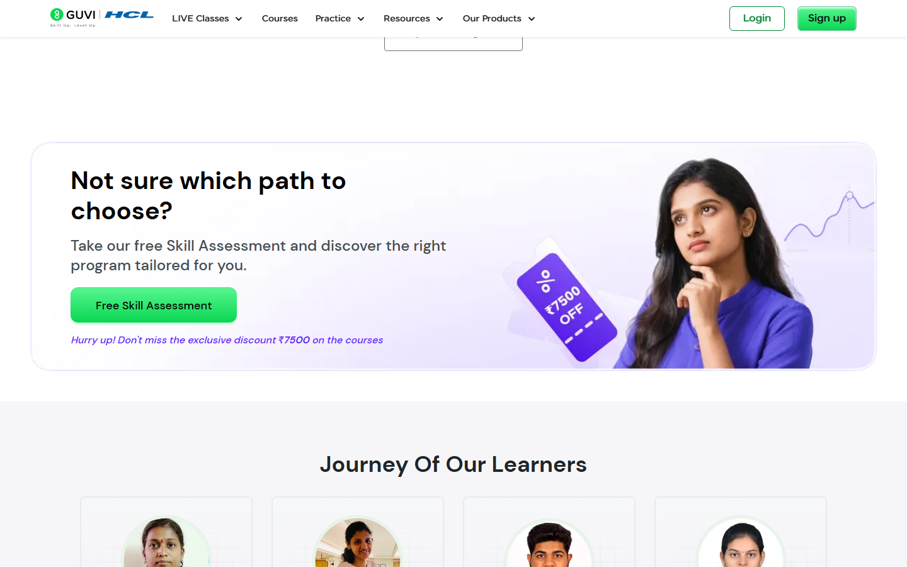

### 33% scroll depth

*Scroll position: 2687px of 9043px total*

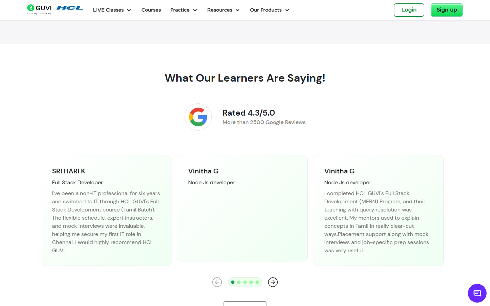

### 50% scroll depth

*Scroll position: 4072px of 9043px total*

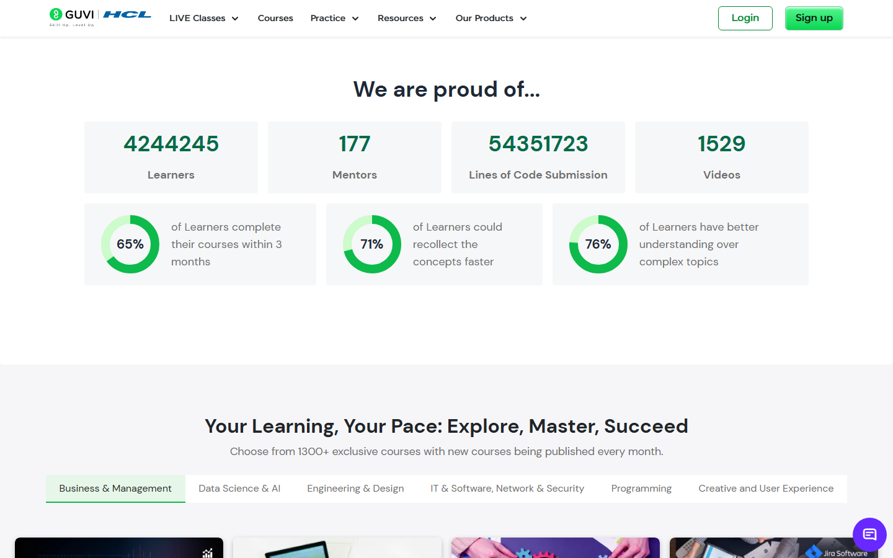

### 67% scroll depth

*Scroll position: 5456px of 9043px total*

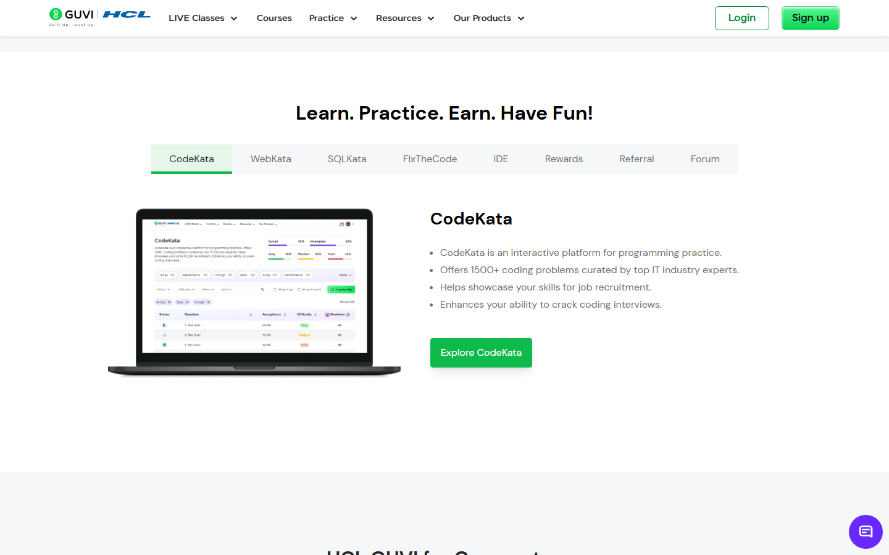

### 83% scroll depth

*Scroll position: 6759px of 9043px total*

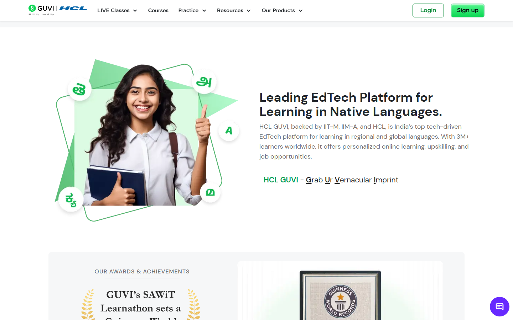

### Footer — End of page

*Scroll position: 8143px of 9043px total*

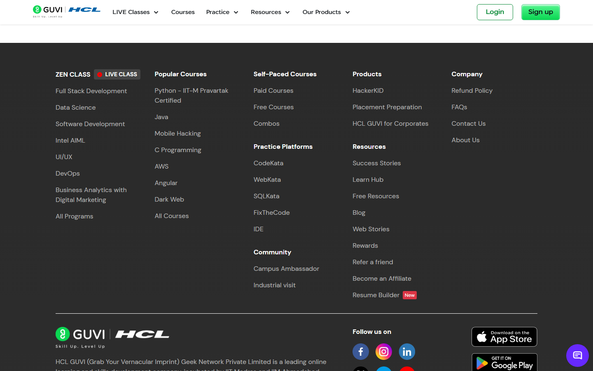

## Full Page Screenshots

### HCL GUVI | Learn to code in your native language

*URL: `https://www.guvi.in/?ref=zmiwode&utm_source=Affiliate&utm_medium=Zemads_Media_CPS&utm_content=Home_Apr_2026&utm_campaign=213&gad_source=1&gad_campaignid=23731142847&gbraid=0AAAABDOaqhhLB2_1-Ep_a7dQ4TvCsSnNp&gclid=CjwKCAjw7KvTBhA6EiwAWnutYftw04XeQv-0eeCTZeArjlDiXlaZ466dicULwPr-rMotXJkkvabJRRoCrjYQAvD_BwE`*

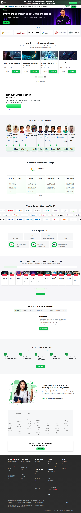

### IIM Indore Product Management Program | HCL GUVI

*URL: `https://www.guvi.in/zen-class/iim-indore-product-management/?prod_feature=HomePage%20-TopbannerStrip-IIM-PM`*

### Zen Class - Career Programs from HCL GUVI

*URL: `https://www.guvi.in/zen-class?utm_source=product_feature-onboarding_popup&utm_medium=zen_exploremore&prod_feature=Homepage-User-Roadmap-Loggedin`*

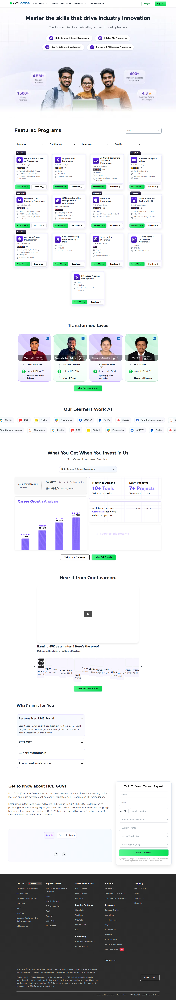

### HCL GUVI | courses

*URL: `https://www.guvi.in/courses/?current_tab=myCourses&utm_source=product_feature-onboarding_popup&utm_medium=courses_exploremore`*

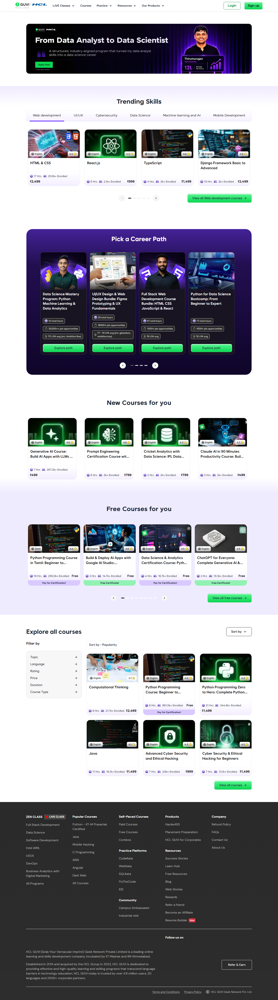

### HCL GUVI | Learn to code in your native language

*URL: `https://www.guvi.in/code-kata/`*

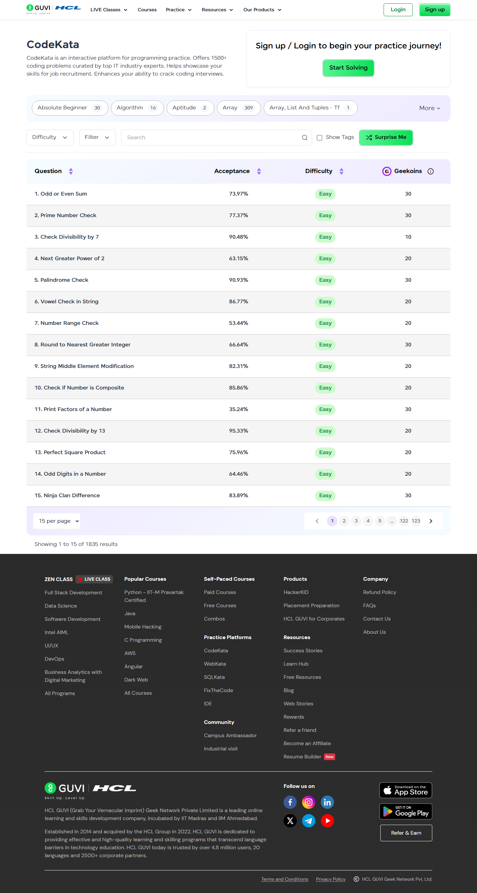

## Section Screenshots

Clipped sections showing individual components in context.

### Section 1 — `section`

*1440×213px*

### Section 2 — `section`

*1440×904px*

### Section 1 — `[class*="section"]`

*1440×980px*

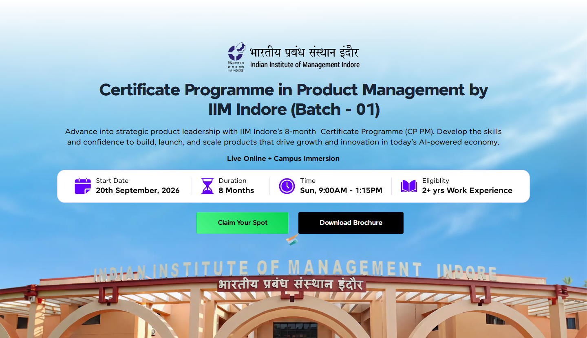

### Section 2 — `[class*="section"]`

*1440×508px*

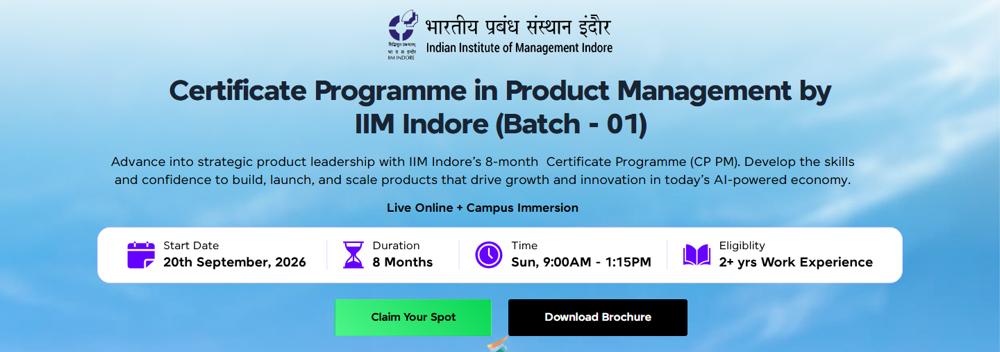

### Section 1 — `section`

*1440×900px*

### Section 1 — `section`

*1440×675px*

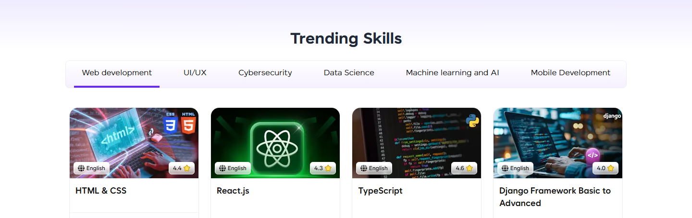

### Section 3 — `main > div`

*1200×386px*

